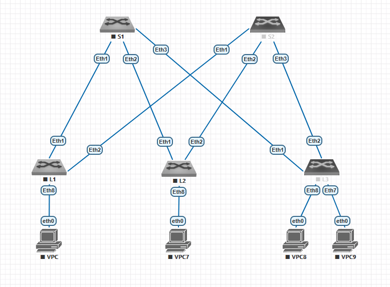
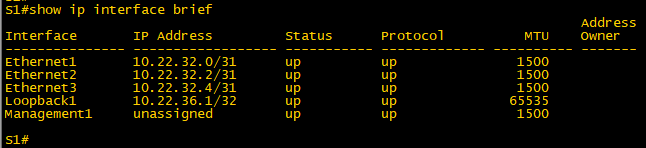
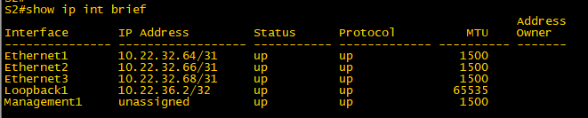

# Лабораторная работа №1
## Проектирование адресного пространства

### Цель:
1. Собрать топологию CLOS, как на схеме;
2. Распределить адресное пространство для Underlay сети;
3. Зафиксировать в документации план работ, адресное пространство, схему сети, настройки.

 
### Выполнение

На стенде создана топология CLOS, включающая 5 коммутаторов Arista vEOS. Коммутаторы S1 и S2 выполняют роль Spine, коммутаторы L1, L2, L3 выполняют роль Leaf. К Leaf коммутаторам подключены узлы VPC, имитирующие клиентские сервисы.
Итоговая схема сети приведена на рисунке ниже.

Поскольку для планирования адресного пространства никаких исходных данных и ограничений в задании не указано, предположим следующее:

Планируем ЦОД для филиала большой компании АО "Нефтегазалмазколбасазолотодобыча".
Предполагаем, что в перспективе размер данного ЦОД не превысит 32 Leaf коммутатора и 16 Spine. 
Для построения Underlay сети из общего адресного пространства компании выделяется подсеть 10.22.32.0/21.
Сервисы компании живут в отдельном адресном пространстве в диапазоне адресов 172.22.0.0/16

Подсеть 10.22.32.0/22 планируем использовать для адресации P2P линков между Spine и Leaf коммутаторами. 10 бит для адресации хостов в данной подсети планируем использовать следующим образом:

**sssslllllх**

где биты **s** и **l** кодируют номер Spine и Leaf коммутатора соответственно, а бит **х** имеет значение 0 на стороне Spine и 1 на стороне Leaf.

Подсеть **10.22.36.0/24** планируем использовать для адресации Loopback адресов Spine коммутаторов.
Подсеть **10.22.37.0/24** планируем использовать для адресации Loopback адресов Leaf коммутаторов.
Подсеть **10.22.38.0/23** - резерв. 

Полное итоговое распределение адресного пространства приведено в файле IP_planing_tool_v1.xlsx в папке проекта.
Адресация для актуальных устройств на стенде приведена в таблицах ниже.

Подсети, выделенные для P2P интерфейсов:

| P2P |	L1 | L2 | L3 |
|---|----|---|---|
| **S1** | 10.22.32.0/31 | 10.22.32.2/31 | 10.22.32.4/31 |
| **S2** | 10.22.32.64/31 | 10.22.32.66/31 | 10.22.32.68/31 |

Адреса Loopback интерфейсов:

|  Spine |	S1 | S2 |
|-------------|---------------|---------------|
| loopback | 10.22.36.1/32 | 10.22.36.2/32 |

|  Leaf |	L1 | L2 | L3 |
|-------------|---------------|---------------|------------|
| loopback |	10.22.37.1/32 | 10.22.37.2/32 | 10.22.37.3/32 |

Применяем приведенные настройки IP адресов на интерфейсах коммутаторов. Так же настраиваем hostname, отключаем icmp redirect и создаем базовую конфигурацию ospf для обеспечения связности.

#### Настройки коммутатора S1:
'''
hostname S1

interface Ethernet1
   no switchport
   ip address 10.22.32.0/31
   ip ospf network point-to-point

interface Ethernet2
   no switchport
   ip address 10.22.32.2/31
   ip ospf network point-to-point

interface Ethernet3
   no switchport
   ip address 10.22.32.4/31
   ip ospf network point-to-point

interface Loopback1
   ip address 10.22.36.1/32
!
no ip icmp redirect
!
router ospf 1
   router-id 10.22.36.1
   bfd default
   passive-interface Loopback1
   network 10.22.32.0/21 area 0.0.0.1
end
'''

#### Настройки коммутатора S2:
'''
hostname S2

interface Ethernet1
   no switchport
   ip address 10.22.32.64/31
   ip ospf network point-to-point

interface Ethernet2
   no switchport
   ip address 10.22.32.66/31
   ip ospf network point-to-point

interface Ethernet3
   no switchport
   ip address 10.22.32.68/31
   ip ospf network point-to-point

interface Loopback1
   ip address 10.22.36.2/32

no ip icmp redirect

router ospf 1
   router-id 10.22.36.2
   bfd default
   passive-interface Loopback1
   network 10.22.32.0/21 area 0.0.0.1
end
'''

#### Настройки коммутатора L1:
'''
hostname L1

interface Ethernet1
   no switchport
   ip address 10.22.32.1/31
   ip ospf network point-to-point

interface Ethernet2
   no switchport
   ip address 10.22.32.65/31
   ip ospf network point-to-point

interface Loopback1
   ip address 10.22.37.1/32

no ip icmp redirect

router ospf 1
   router-id 10.22.37.1
   bfd default
   passive-interface Loopback1
   network 10.22.32.0/21 area 0.0.0.1
end
'''

#### Настройки коммутатора L2:
'''
hostname L2

interface Ethernet1
   no switchport
   ip address 10.22.32.3/31
   ip ospf network point-to-point

interface Ethernet2
   no switchport
   ip address 10.22.32.67/31
   ip ospf network point-to-point

interface Loopback1
   ip address 10.22.37.2/32

no ip icmp redirect

router ospf 1
   router-id 10.22.37.2
   bfd default
   passive-interface Loopback1
   network 10.22.32.0/21 area 0.0.0.1
end
'''

#### Настройки коммутатора L3:
'''
hostname L3

interface Ethernet1
   no switchport
   ip address 10.22.32.5/31
   ip ospf network point-to-point

interface Ethernet2
   no switchport
   ip address 10.22.32.69/31
   ip ospf network point-to-point

interface Loopback1
   ip address 10.22.37.3/32

no ip icmp redirect

router ospf 1
   router-id 10.22.37.3
   bfd default
   passive-interface Loopback1
   network 10.22.32.0/21 area 0.0.0.1
end
'''

### Проверка результатов

Проверяем настройки адресов на интерфейсах командой ***show ip interface breaf***:

| S1 | S2 |
|---|---|
|  |  | 

| L1 | L2 | L3 |
|---|---|---|
|  |  |  | 

