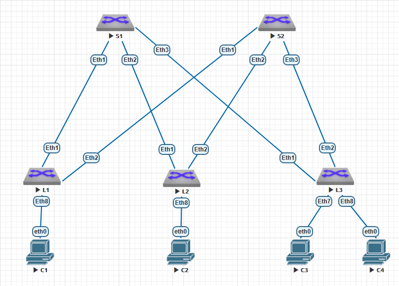
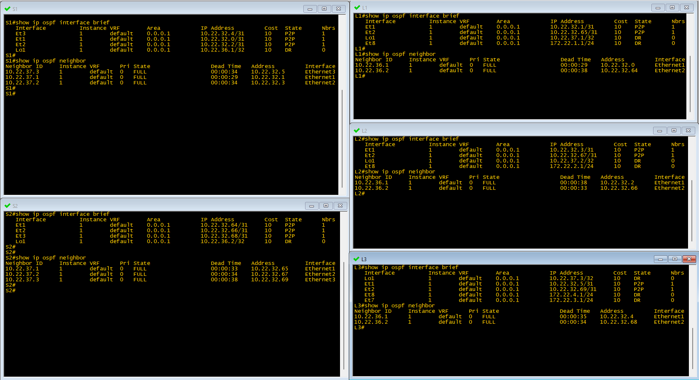
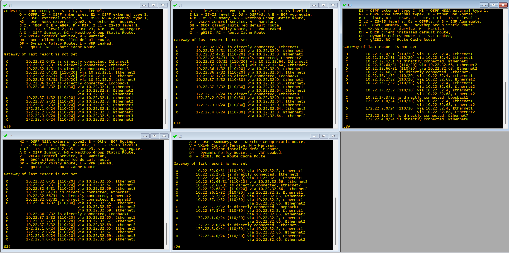
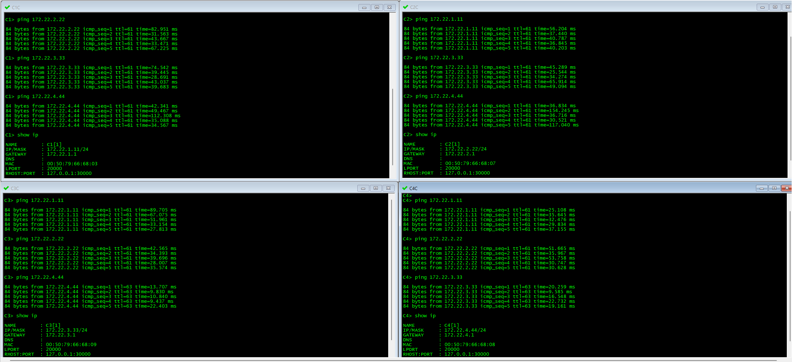

# Лабораторная работа №2
## Underlay. OSPF

### Цель:
Настроить OSPF для Underlay сети.


### Выполнение
В общем и целом цель данной  работы была уже достигнута в предыдущей [лабораторной работе №1](https://github.com/i-gershuni/OTUS-DC-NET-Design-Labs/tree/82b7ce8b1be000731163ed32d370006d2b370917/Lab1).
В данной работе добавим клиентские сети и проанонсируем их по OSPF, а так же проведем некоторый тюнинг настроек OSPF, в соответствии с рекомендациями, полученными на последнем занятии: 

- Настроим MD5 авторизацию;
- Настроим passive interface default;
- Настроим ip ospf area на интерфейсах вместо использования network;
- Настроим рекоменлованные таймеры для BFD.

Схема сети, испольуемая в данной работе, представлена на рисунке ниже.




Адресация для актуальных устройств на стенде приведена в таблицах ниже.

Подсети, выделенные для P2P интерфейсов:

| P2P |	L1 | L2 | L3 |
|---|----|---|---|
| **S1** | 10.22.32.0/31 | 10.22.32.2/31 | 10.22.32.4/31 |
| **S2** | 10.22.32.64/31 | 10.22.32.66/31 | 10.22.32.68/31 |

Адреса Loopback интерфейсов:

|  Spine |	S1 | S2 |
|-------------|---------------|---------------|
| loopback | 10.22.36.1/32 | 10.22.36.2/32 |

|  Leaf |	L1 | L2 | L3 |
|-------------|---------------|---------------|------------|
| loopback |	10.22.37.1/32 | 10.22.37.2/32 | 10.22.37.3/32 |

Адреса интерфейсов в сторону клиентских подсетей:

| If\Sw | L1 | L2 | L3 |
|---|--|--|--|
| Ethernet 7 | 172.22.1.1/24 | 172.22.2.1/24 | 172.22.3.1/24 |
| Ethernet 8 | | | 172.22.1.1/24 |

Настройки IP на клиентских устройствах:

| Client | IP Addr | Def GW |
|---|---|
| C1 | 172.22.1.11/24 | 172.22.1.1 |
| C2 | 172.22.2.22/24 | 172.22.2.1 |
| C2 | 172.22.3.33/24 | 172.22.3.1 |
| C2 | 172.22.4.44/24 | 172.22.4.1 |

Применяем приведенные настройки IP адресов на интерфейсах коммутаторов. Так же настраиваем hostname, отключаем icmp redirect и создаем базовую конфигурацию ospf для обеспечения связности.

#### Настройки коммутатора S1:
```
hostname S1

interface Ethernet1
   no switchport
   ip address 10.22.32.0/31
   ip ospf network point-to-point

interface Ethernet2
   no switchport
   ip address 10.22.32.2/31
   ip ospf network point-to-point

interface Ethernet3
   no switchport
   ip address 10.22.32.4/31
   ip ospf network point-to-point

interface Loopback1
   ip address 10.22.36.1/32
!
no ip icmp redirect
!
router ospf 1
   router-id 10.22.36.1
   bfd default
   passive-interface Loopback1
   network 10.22.32.0/21 area 0.0.0.1
end
```

#### Настройки коммутатора S2:
```
hostname S2

interface Ethernet1
   no switchport
   ip address 10.22.32.64/31
   ip ospf network point-to-point

interface Ethernet2
   no switchport
   ip address 10.22.32.66/31
   ip ospf network point-to-point

interface Ethernet3
   no switchport
   ip address 10.22.32.68/31
   ip ospf network point-to-point

interface Loopback1
   ip address 10.22.36.2/32

no ip icmp redirect

router ospf 1
   router-id 10.22.36.2
   bfd default
   passive-interface Loopback1
   network 10.22.32.0/21 area 0.0.0.1
end
```

#### Настройки коммутатора L1:
```
hostname L1

interface Ethernet1
   no switchport
   ip address 10.22.32.1/31
   ip ospf network point-to-point

interface Ethernet2
   no switchport
   ip address 10.22.32.65/31
   ip ospf network point-to-point

interface Loopback1
   ip address 10.22.37.1/32

no ip icmp redirect

router ospf 1
   router-id 10.22.37.1
   bfd default
   passive-interface Loopback1
   network 10.22.32.0/21 area 0.0.0.1
end
```

#### Настройки коммутатора L2:
```
hostname L2

interface Ethernet1
   no switchport
   ip address 10.22.32.3/31
   ip ospf network point-to-point

interface Ethernet2
   no switchport
   ip address 10.22.32.67/31
   ip ospf network point-to-point

interface Loopback1
   ip address 10.22.37.2/32

no ip icmp redirect

router ospf 1
   router-id 10.22.37.2
   bfd default
   passive-interface Loopback1
   network 10.22.32.0/21 area 0.0.0.1
end
```

#### Настройки коммутатора L3:
```
hostname L3

interface Ethernet1
   no switchport
   ip address 10.22.32.5/31
   ip ospf network point-to-point

interface Ethernet2
   no switchport
   ip address 10.22.32.69/31
   ip ospf network point-to-point

interface Loopback1
   ip address 10.22.37.3/32

no ip icmp redirect

router ospf 1
   router-id 10.22.37.3
   bfd default
   passive-interface Loopback1
   network 10.22.32.0/21 area 0.0.0.1
end
```

### Проверка результатов

show ip ospf interface | i (is up|State|Neigh|auth)
show bfd peers detail | i (Peer|^TxInt:)


Проверяем настройки адресов на интерфейсах командой ***show ip interface breaf***:

| S1 | S2 |
|---|---|
|  |  | 

| L1 | L2 | L3 |
|---|---|---|
|  |  |  | 

Проверяем состояние OSPF интерфейсов и соседства:


Проверяем таблицу маршрутизации. Обращаем внимание, что на каждом каждом leaf есть два маршрута с равной стоимость до loopback адресов соседей: 


Проверяем IP-связность между leaf коммутатора, выполнив ping c каждого коммутатора до loopback его соседей:


***Все работает так, как и было задумано :thumbsup:***