# Лабораторная работа №3

## Underlay. IS-IS

### Цель:
Настроить IS-IS для Underlay сети.


### Выполнение

Для выполнения данной работы используем топологию сети и IPv4 адресацию, разработанную в [лабораторной работе №1](https://github.com/i-gershuni/OTUS-DC-NET-Design-Labs/tree/82b7ce8b1be000731163ed32d370006d2b370917/Lab1).
Кроме того, чтобы немного развлечься, предположим, что у нас в планах предстоит мигрирация на IPv6, поэтому кроме IPv4 Underlay мы хотим развернуть так же IPv6 Underlay в режиме Dual-Stack.


Схема сети, используемая в данной работе, представлена на рисунке ниже.

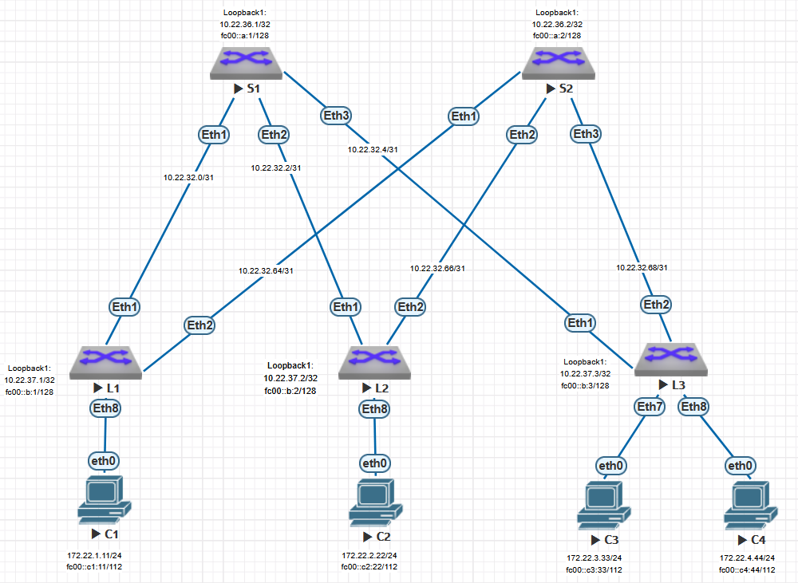


### IPv4 адресация, используемая в данной работе


IPv4 адресация для устройств на стенде приведена в таблицах ниже.

#### Подсети, выделенные для P2P интерфейсов:

| P2P |	L1 | L2 | L3 |
|---|----|---|---|
| **S1** | 10.22.32.0/31 | 10.22.32.2/31 | 10.22.32.4/31 |
| **S2** | 10.22.32.64/31 | 10.22.32.66/31 | 10.22.32.68/31 |

#### Адреса Loopback интерфейсов:

|  Spine |	S1 | S2 |
|-------------|---------------|---------------|
| loopback | 10.22.36.1/32 | 10.22.36.2/32 |

|  Leaf |	L1 | L2 | L3 |
|-------------|---------------|---------------|------------|
| loopback |	10.22.37.1/32 | 10.22.37.2/32 | 10.22.37.3/32 |

#### Адреса интерфейсов в сторону клиентских подсетей:

| If\Sw | L1 | L2 | L3 |
|---|--|--|--|
| **Ethernet 7** | | | 172.22.3.1/24 |
| **Ethernet 8** | 172.22.1.1/24 | 172.22.2.1/24 | 172.22.4.1/24 |

#### Настройки IP на клиентских устройствах:

| Client | IP Addr | Def GW |
|---|---|---|
| **C1** | 172.22.1.11/24 | 172.22.1.1 |
| **C2** | 172.22.2.22/24 | 172.22.2.1 |
| **C3** | 172.22.3.33/24 | 172.22.3.1 |
| **C4** | 172.22.4.44/24 | 172.22.4.1 |


Для IPv6 адресов клиентских подсетей и loopback возмем произвольные адреса в диапазоне ULA (Unique Local Address) (fc00::/7). 
Для P2P сетей будем использовать link-local адреса.

### IPv6 адресация, используемая в данной работе


#### Адреса Loopback интерфейсов:

|  Spine |	S1 | S2 |
|-------------|---------------|---------------|
| loopback | fc00::a:1/128 |  fc00::a:2/128  |

|  Leaf |	L1 | L2 | L3 |
|-------------|---------------|---------------|------------|
| loopback |  fc00::b:1/128  | fc00::b:2/128 | fc00::b:3/128 |

#### Адреса интерфейсов в сторону клиентских подсетей:

| If\Sw | L1 | L2 | L3 |
|---|--|--|--|
| **Ethernet 7** | | | fc00::c3.1/112 |
| **Ethernet 8** | fc00::c1:1/112 | fc00::c2:1/112 | fc00::c4:1/112 |

#### Настройки IP на клиентских устройствах:

| Client | IP Addr | Def GW |
|---|---|---|
| **C1** | fc00::c1:11/120 | fc00::c1.1 |
| **C2** | fc00::c2:22/120 | fc00::c2.1 |
| **C3** | fc00::c3:33/120 | fc00::c3.1 |
| **C4** | fc00::c4:44/120 | fc00::c4.1 |


### Выполняем настройки на коммутаторах:

#### Настраиваем IS-IS маршрутизатор

- на всех коммутаторах настраиваем экземпляр IS-IS маршрутзатора с именем **Underlay**
- NET (Network Entity Title) формируем по принципу *49.{код_ЦОД}.{номер_pod}.{1 для spine, 2 для leaf}.{Номер_коммутатора}.00*  
Пусть код нашего ЦОД будет 22, такм образом NET на наших коммутаторах будут следующие:

| SW | NET |
|---|---|
| S1 | 49.0022.0001.0001.0001.00 |
| S2 | 49.0022.0001.0001.0002.00 |
| L1 | 49.0022.0001.0002.0001.00 |
| L2 | 49.0022.0001.0002.0002.00 |
| L3 | 49.0022.0001.0002.0003.00 |

- Поскольку у нас планируется только один pod, то тип маршрутизатора и все линки делаем L1;
- Для поддержки IPv4 добавляем address-family ipv4;
- Для поддержки IPv6 добавляем address-family ipv6.

#### Настраиваем интерфейсы

- включаем на коммутаторе маршрутизацию IPv6;
- включаем на интерфейсах IPv6;
- на loopback и клиентских интерфейсах настраивает IPv6 адрес в дополнение к уже существующему IPv4;
- включаем на интерфейсе протокол IS-IS для instance Underlay;
- настраиваем тип интерфейса L1 и тип сети point-to-point;
- включаем BFD и настраиваем рекомендованные значения таймеров;
- настраиваем аутентификацию;
- Loopback и интерфейсы в сторону клиентов настраиваем как passive.

### Итоговые настройки коммутаторов:

#### Настройки коммутатора S1:
```
hostname S1
!
interface Ethernet1
   description Leaf1_Et1
   no switchport
   ip address 10.22.32.0/31
   bfd interval 100 min-rx 100 multiplier 3
   ipv6 enable
   isis enable Underlay
   isis bfd
   isis circuit-type level-1
   isis network point-to-point
   isis authentication mode sha key-id 1
   isis authentication key-id 1 algorithm sha-256 key 7 NSFjnA0bJybM4espbUU41w==
!
interface Ethernet2
   description Leaf2_Et1
   no switchport
   ip address 10.22.32.2/31
   bfd interval 100 min-rx 100 multiplier 3
   ipv6 enable
   isis enable Underlay
   isis bfd
   isis circuit-type level-1
   isis network point-to-point
   isis authentication mode sha key-id 1
   isis authentication key-id 1 algorithm sha-256 key 7 NSFjnA0bJybM4espbUU41w==
!
interface Ethernet3
   description Leaf3_Et1
   no switchport
   ip address 10.22.32.4/31
   bfd interval 100 min-rx 100 multiplier 3
   ipv6 enable
   isis enable Underlay
   isis bfd
   isis circuit-type level-1
   isis network point-to-point
   isis authentication mode sha key-id 1
   isis authentication key-id 1 algorithm sha-256 key 7 NSFjnA0bJybM4espbUU41w==
!
interface Loopback1
   ip address 10.22.36.1/32
   ipv6 address fc00::a:1/128
   isis enable Underlay
   isis passive
!
ip routing
no ip icmp redirect
!
ipv6 unicast-routing
!
router isis Underlay
   net 49.0022.0001.0001.0001.00
   is-type level-1
   log-adjacency-changes
   !
   address-family ipv4 unicast
   !
   address-family ipv6 unicast
!
end
```

#### Настройки коммутатора S2:
```
hostname S2
!
interface Ethernet1
   description Leaf1_Et2
   no switchport
   ip address 10.22.32.64/31
   bfd interval 100 min-rx 100 multiplier 3
   ipv6 enable
   isis enable Underlay
   isis bfd
   isis circuit-type level-1
   isis network point-to-point
   isis authentication mode sha key-id 1
   isis authentication key-id 1 algorithm sha-256 key 7 NSFjnA0bJybM4espbUU41w==
!
interface Ethernet2
   description Leaf2_Et2
   no switchport
   ip address 10.22.32.66/31
   bfd interval 100 min-rx 100 multiplier 3
   ipv6 enable
   isis enable Underlay
   isis bfd
   isis circuit-type level-1
   isis network point-to-point
   isis authentication mode sha key-id 1
   isis authentication key-id 1 algorithm sha-256 key 7 NSFjnA0bJybM4espbUU41w==
!
interface Ethernet3
   description Leaf3_Et2
   no switchport
   ip address 10.22.32.68/31
   bfd interval 100 min-rx 100 multiplier 3
   ipv6 enable
   isis enable Underlay
   isis bfd
   isis circuit-type level-1
   isis network point-to-point
   isis authentication mode sha key-id 1
   isis authentication key-id 1 algorithm sha-256 key 7 NSFjnA0bJybM4espbUU41w==
!
interface Loopback1
   ip address 10.22.36.2/32
   ipv6 address fc00::a:2/128
   isis enable Underlay
   isis passive
!
ip routing
no ip icmp redirect
!
ipv6 unicast-routing
!
router isis Underlay
   net 49.0022.0001.0001.0002.00
   is-type level-1
   log-adjacency-changes
   !
   address-family ipv4 unicast
   !
   address-family ipv6 unicast
!
end
```

#### Настройки коммутатора L1:
```
hostname L1
!
interface Ethernet1
   description Spoke1_Et1
   no switchport
   ip address 10.22.32.1/31
   bfd interval 100 min-rx 100 multiplier 3
   ipv6 enable
   isis enable Underlay
   isis bfd
   isis circuit-type level-1
   isis network point-to-point
   isis authentication mode sha key-id 1
   isis authentication key-id 1 algorithm sha-256 key 7 NSFjnA0bJybM4espbUU41w==
!
interface Ethernet2
   description Spoke2_Et1
   no switchport
   ip address 10.22.32.65/31
   bfd interval 100 min-rx 100 multiplier 3
   ipv6 enable
   isis enable Underlay
   isis bfd
   isis circuit-type level-1
   isis network point-to-point
   isis authentication mode sha key-id 1
   isis authentication key-id 1 algorithm sha-256 key 7 NSFjnA0bJybM4espbUU41w==
!
interface Ethernet8
   description ClientSubNet1
   no switchport
   ip address 172.22.1.1/24
   ipv6 address fc00::c1:1/112
   isis enable Underlay
   isis passive
!
interface Loopback1
   ip address 10.22.37.1/32
   ipv6 address fc00::b:1/128
   isis enable Underlay
   isis passive
!
ip routing
no ip icmp redirect
!
ipv6 unicast-routing
!
router isis Underlay
   net 49.0022.0001.0002.0001.00
   is-type level-1
   log-adjacency-changes
   !
   address-family ipv4 unicast
   !
   address-family ipv6 unicast
!
end
```

#### Настройки коммутатора L2:
```
hostname L2
!
interface Ethernet1
   description Spine1_Et2
   no switchport
   ip address 10.22.32.3/31
   bfd interval 100 min-rx 100 multiplier 3
   ipv6 enable
   isis enable Underlay
   isis bfd
   isis circuit-type level-1
   isis network point-to-point
   isis authentication mode sha key-id 1
   isis authentication key-id 1 algorithm sha-256 key 7 NSFjnA0bJybM4espbUU41w==
!
interface Ethernet2
   description Spine2_Et2
   no switchport
   ip address 10.22.32.67/31
   bfd interval 100 min-rx 100 multiplier 3
   ipv6 enable
   isis enable Underlay
   isis bfd
   isis circuit-type level-1
   isis network point-to-point
   isis authentication mode sha key-id 1
   isis authentication key-id 1 algorithm sha-256 key 7 NSFjnA0bJybM4espbUU41w==
!
interface Ethernet8
   description ClientSubNet2
   no switchport
   ip address 172.22.2.1/24
   ipv6 address fc00::c2:1/112
   isis enable Underlay
   isis passive
!
interface Loopback1
   ip address 10.22.37.2/32
   ipv6 address fc00::b:2/128
   isis enable Underlay
   isis passive
!
ip routing
no ip icmp redirect
!
ipv6 unicast-routing
!
router isis Underlay
   net 49.0022.0001.0002.0002.00
   is-type level-1
   log-adjacency-changes
   !
   address-family ipv4 unicast
   !
   address-family ipv6 unicast
!
end
```

#### Настройки коммутатора L3:
```
hostname L3
!
interface Ethernet1
   description Spine1_Et3
   no switchport
   ip address 10.22.32.5/31
   bfd interval 100 min-rx 100 multiplier 3
   ipv6 enable
   isis enable Underlay
   isis bfd
   isis circuit-type level-1
   isis network point-to-point
   isis authentication mode sha key-id 1
   isis authentication key-id 1 algorithm sha-256 key 7 NSFjnA0bJybM4espbUU41w==
!
interface Ethernet2
   description Spine2_Et3
   no switchport
   ip address 10.22.32.69/31
   bfd interval 100 min-rx 100 multiplier 3
   ipv6 enable
   isis enable Underlay
   isis bfd
   isis circuit-type level-1
   isis network point-to-point
   isis authentication mode sha key-id 1
   isis authentication key-id 1 algorithm sha-256 key 7 NSFjnA0bJybM4espbUU41w==
!
interface Ethernet7
   description ClientSubNet3
   no switchport
   ip address 172.22.3.1/24
   ipv6 address fc00::c3:1/112
   isis enable Underlay
   isis passive
!
interface Ethernet8
   description ClientSubNet4
   no switchport
   ip address 172.22.4.1/24
   ipv6 address fc00::c4:1/112
   isis enable Underlay
   isis passive
!
interface Loopback1
   ip address 10.22.37.3/32
   ipv6 address fc00::b:3/128
   isis enable Underlay
   isis passive
!
ip routing
no ip icmp redirect
!
ipv6 unicast-routing
!
router isis Underlay
   net 49.0022.0001.0002.0003.00
   is-type level-1
   log-adjacency-changes
   !
   address-family ipv4 unicast
   !
   address-family ipv6 unicast
!
end
```

***

### Проверка результатов

##### Проверяем настройки адресов на интерфейсах:
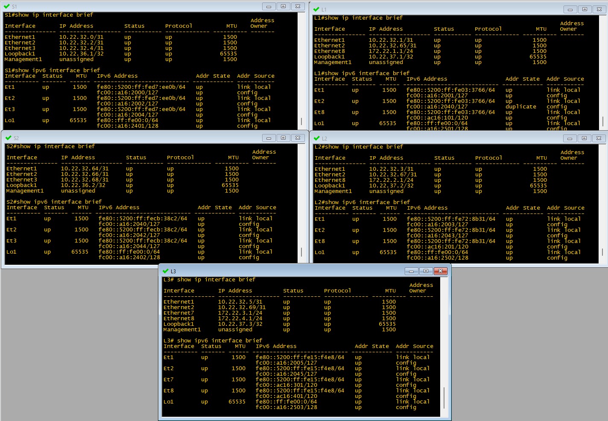

##### Проверяем IS-IS интерфейсы, убеждаемся, что включена поддержка IPv4 и IPv6:
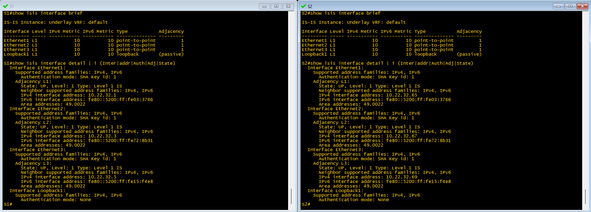
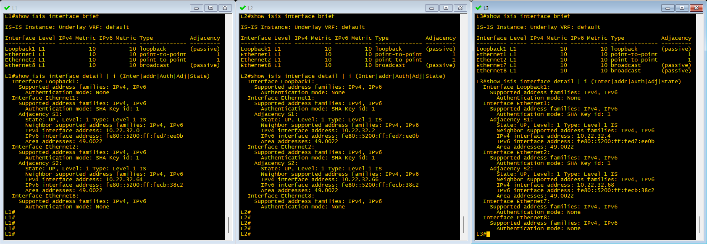

#### Проверяем соседство и сетевую топологию IS-IS:
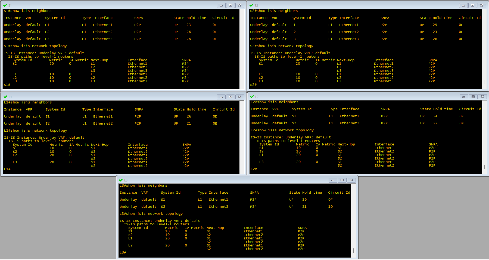
 
##### Посмотрим на IS-IS database (приводится вывод только с одного коммутатора, на остальных вывод аналогичный):
```
S1#show isis database detail 

IS-IS Instance: Underlay VRF: default
  IS-IS Level 1 Link State Database
    LSPID                   Seq Num  Cksum  Life Length IS Flags
    S1.00-00                   4382  17364  1186    185 L1 <>
      LSP generation remaining wait time: 0 ms
      Time remaining until refresh: 886 s
      NLPID: 0xCC(IPv4) 0x8E(IPv6)
      Hostname: S1
      Area addresses: 49.0022
      Interface address: 10.22.32.4
      Interface address: 10.22.32.2
      Interface address: 10.22.36.1
      Interface address: 10.22.32.0
      Interface address: fc00::a:1
      IS Neighbor          : L3.00               Metric: 10
      IS Neighbor          : L2.00               Metric: 10
      IS Neighbor          : L1.00               Metric: 10
      Reachability         : 10.22.32.4/31 Metric: 10 Type: 1 Up
      Reachability         : 10.22.32.2/31 Metric: 10 Type: 1 Up
      Reachability         : 10.22.36.1/32 Metric: 10 Type: 1 Up
      Reachability         : 10.22.32.0/31 Metric: 10 Type: 1 Up
      Reachability          : fc00::a:1/128 Metric: 10 Type: 1 Up
      Router Capabilities: Router Id: 10.22.36.1 Flags: []
        Area leader priority: 250 algorithm: 0
    S2.00-00                   3988  18387   883    185 L1 <>
      Remaining lifetime received: 1199 s Modified to: 1200 s
      NLPID: 0xCC(IPv4) 0x8E(IPv6)
      Hostname: S2
      Area addresses: 49.0022
      Interface address: 10.22.36.2
      Interface address: 10.22.32.68
      Interface address: 10.22.32.66
      Interface address: 10.22.32.64
      Interface address: fc00::a:2
      IS Neighbor          : L1.00               Metric: 10
      IS Neighbor          : L3.00               Metric: 10
      IS Neighbor          : L2.00               Metric: 10
      Reachability         : 10.22.36.2/32 Metric: 10 Type: 1 Up
      Reachability         : 10.22.32.68/31 Metric: 10 Type: 1 Up
      Reachability         : 10.22.32.66/31 Metric: 10 Type: 1 Up
      Reachability         : 10.22.32.64/31 Metric: 10 Type: 1 Up
      Reachability          : fc00::a:2/128 Metric: 10 Type: 1 Up
      Router Capabilities: Router Id: 10.22.36.2 Flags: []
        Area leader priority: 250 algorithm: 0
    L1.00-00                   2811  37943   648    209 L1 <>
      Remaining lifetime received: 1199 s Modified to: 1200 s
      NLPID: 0xCC(IPv4) 0x8E(IPv6)
      Hostname: L1
      Area addresses: 49.0022
      Interface address: 10.22.32.65
      Interface address: 172.22.1.1
      Interface address: 10.22.32.1
      Interface address: 10.22.37.1
      Interface address: fc00::b:1
      Interface address: fc00::c1:1
      IS Neighbor          : S2.00               Metric: 10
      IS Neighbor          : S1.00               Metric: 10
      Reachability         : 10.22.32.64/31 Metric: 10 Type: 1 Up
      Reachability         : 172.22.1.0/24 Metric: 10 Type: 1 Up
      Reachability         : 10.22.32.0/31 Metric: 10 Type: 1 Up
      Reachability         : 10.22.37.1/32 Metric: 10 Type: 1 Up
      Reachability          : fc00::b:1/128 Metric: 10 Type: 1 Up
      Reachability          : fc00::c1:0/112 Metric: 10 Type: 1 Up
      Router Capabilities: Router Id: 10.22.37.1 Flags: []
        Area leader priority: 250 algorithm: 0
    L2.00-00                   3028  20622   730    209 L1 <>
      Remaining lifetime received: 1199 s Modified to: 1200 s
      NLPID: 0xCC(IPv4) 0x8E(IPv6)
      Hostname: L2
      Area addresses: 49.0022
      Interface address: 172.22.2.1
      Interface address: 10.22.32.67
      Interface address: 10.22.32.3
      Interface address: 10.22.37.2
      Interface address: fc00::b:2
      Interface address: fc00::c2:1
      IS Neighbor          : S1.00               Metric: 10
      IS Neighbor          : S2.00               Metric: 10
      Reachability         : 172.22.2.0/24 Metric: 10 Type: 1 Up
      Reachability         : 10.22.32.66/31 Metric: 10 Type: 1 Up
      Reachability         : 10.22.32.2/31 Metric: 10 Type: 1 Up
      Reachability         : 10.22.37.2/32 Metric: 10 Type: 1 Up
      Reachability          : fc00::b:2/128 Metric: 10 Type: 1 Up
      Reachability          : fc00::c2:0/112 Metric: 10 Type: 1 Up
      Router Capabilities: Router Id: 10.22.37.2 Flags: []
        Area leader priority: 250 algorithm: 0
    L3.00-00                   3143  63105   768    257 L1 <>
      Remaining lifetime received: 1199 s Modified to: 1200 s
      NLPID: 0xCC(IPv4) 0x8E(IPv6)
      Hostname: L3
      Area addresses: 49.0022
      Interface address: 172.22.4.1
      Interface address: 172.22.3.1
      Interface address: 10.22.32.69
      Interface address: 10.22.32.5
      Interface address: 10.22.37.3
      Interface address: fc00::b:3
      Interface address: fc00::c4:1
      Interface address: fc00::c3:1
      IS Neighbor          : S1.00               Metric: 10
      IS Neighbor          : S2.00               Metric: 10
      Reachability         : 172.22.4.0/24 Metric: 10 Type: 1 Up
      Reachability         : 172.22.3.0/24 Metric: 10 Type: 1 Up
      Reachability         : 10.22.32.68/31 Metric: 10 Type: 1 Up
      Reachability         : 10.22.32.4/31 Metric: 10 Type: 1 Up
      Reachability         : 10.22.37.3/32 Metric: 10 Type: 1 Up
      Reachability          : fc00::b:3/128 Metric: 10 Type: 1 Up
      Reachability          : fc00::c4:0/112 Metric: 10 Type: 1 Up
      Reachability          : fc00::c3:0/112 Metric: 10 Type: 1 Up
      Router Capabilities: Router Id: 10.22.37.3 Flags: []
        Area leader priority: 250 algorithm: 0
S1#
```

#### Проверяем таблицу маршрутизации IPv4:
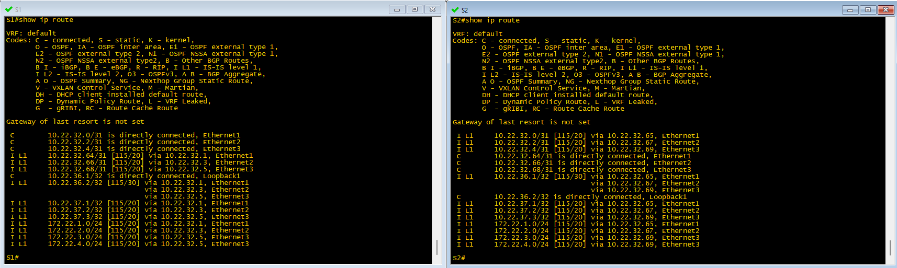
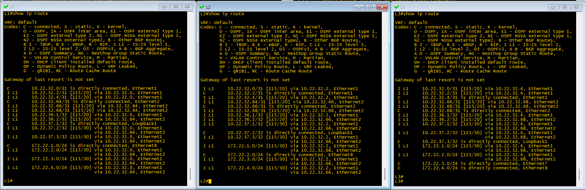

#### Проверяем таблицу маршрутизации IPv6:
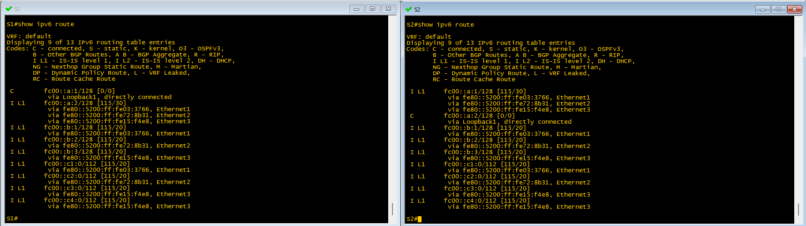
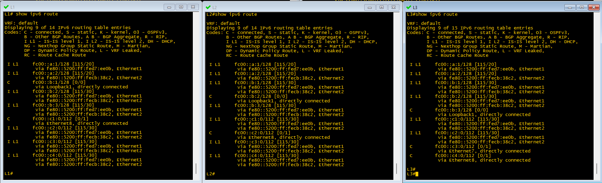

##### Проверяем связность по IPv4 между клиентскими устройствами, выполнив ***ping*** с каждого устройства до всех его соседей:
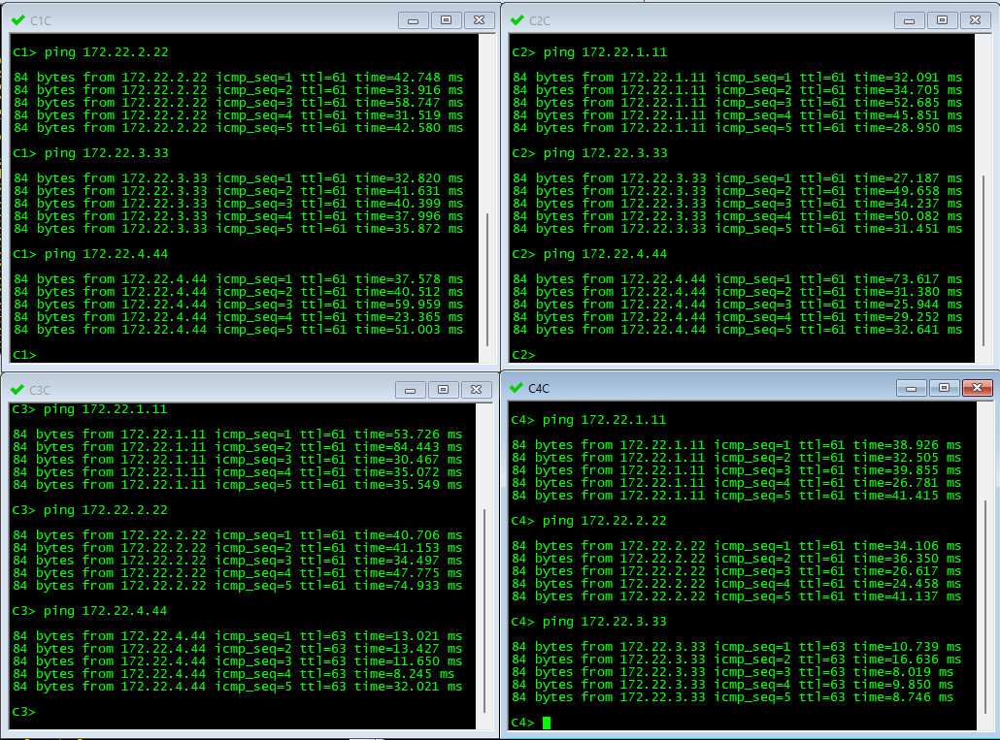

##### И аналогично проверяем связность по IPv6:
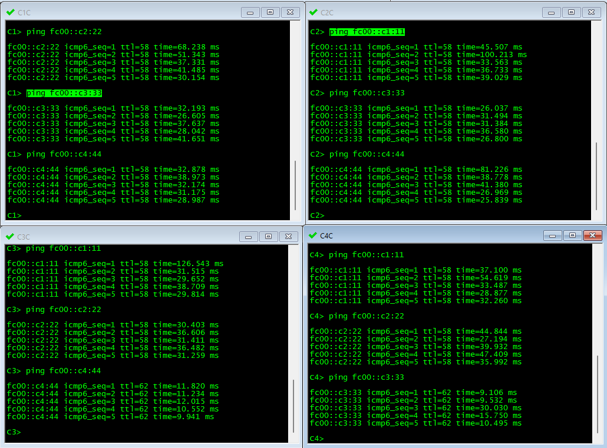

***Все работает как и было задумано!***