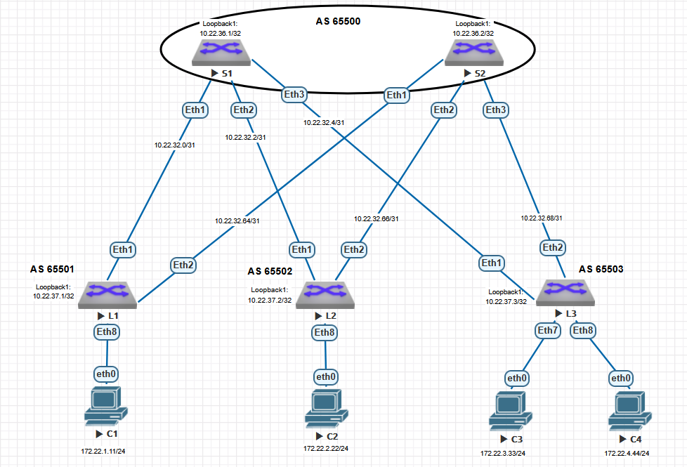
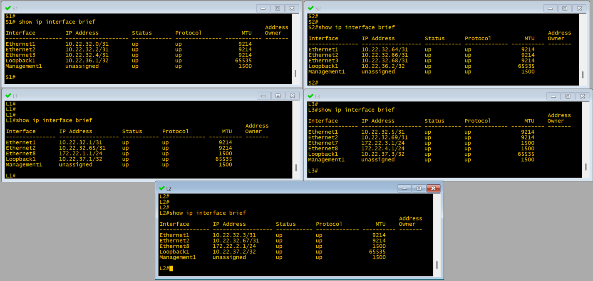

# Лабораторная работа №4

## Underlay. BGP

### Цель:
Настроить BGP для Underlay сети.


### Выполнение

Для выполнения данной работы используем топологию сети и IPv4 адресацию, разработанную в [лабораторной работе №1](https://github.com/i-gershuni/OTUS-DC-NET-Design-Labs/tree/82b7ce8b1be000731163ed32d370006d2b370917/Lab1).

Схема сети, используемая в данной работе, представлена на рисунке ниже.




### IPv4 адресация, используемая в данной работе


IPv4 адресация для устройств на стенде приведена в таблицах ниже.

#### Подсети, выделенные для P2P интерфейсов:

| P2P |	L1 | L2 | L3 |
|---|----|---|---|
| **S1** | 10.22.32.0/31 | 10.22.32.2/31 | 10.22.32.4/31 |
| **S2** | 10.22.32.64/31 | 10.22.32.66/31 | 10.22.32.68/31 |

#### Адреса Loopback интерфейсов:

|  Spine |	S1 | S2 |
|-------------|---------------|---------------|
| loopback | 10.22.36.1/32 | 10.22.36.2/32 |

|  Leaf |	L1 | L2 | L3 |
|-------------|---------------|---------------|------------|
| loopback |	10.22.37.1/32 | 10.22.37.2/32 | 10.22.37.3/32 |

#### Адреса интерфейсов в сторону клиентских подсетей:

| If\Sw | L1 | L2 | L3 |
|---|--|--|--|
| **Ethernet 7** | | | 172.22.3.1/24 |
| **Ethernet 8** | 172.22.1.1/24 | 172.22.2.1/24 | 172.22.4.1/24 |

#### Настройки IP на клиентских устройствах:

| Client | IP Addr | Def GW |
|---|---|---|
| **C1** | 172.22.1.11/24 | 172.22.1.1 |
| **C2** | 172.22.2.22/24 | 172.22.2.1 |
| **C3** | 172.22.3.33/24 | 172.22.3.1 |
| **C4** | 172.22.4.44/24 | 172.22.4.1 |


В качеств протокола маршрутизации underlay сети будем использовать eBGP.

### Выполняем настройки на коммутаторах:

#### Настраиваем интерфейсы
- настраиваем IP адреса на пиринговых интерфейсах, loopback'ах и интерфейсах в сторону клиентов в соответствии с вышеприведенными таблицами;
- на пиринговых интерфейсах настраиваем MTU 9214 ***(Помним, что в виртуальной среде эта настройка может быть источником проблемы, но в реальном мире для MTU рекомендуется это значение)***;

#### Настраиваем eBGP маршрутизацию

- на всех коммутаторах создаем BGP маршрутзатор с номером AS согласно нижепривежденной таблице. Для исключения проблемы path-hunting все Spine помещаются в одну AS, а каждый Leaf в отдельную AS:

| Коммутатор | Номер AS |
|-----------|----------|
| Spine S1 | 6500 |
| Spine S2 | 6500 |
| Leaf L1 | 6501 |
| Leaf L2 | 6502 |
| Leaf L3 | 6503 |

- отключаем автоматическую активацию IPv4 unicast address family командой`no bgp default ipv4-unicast`;
- настраиваем макимальное количество маршрутов для ECMP командой `maximum-paths 2 ecmp 2`;
- настраиваем keepalive и holdtime таймеры BGP для ускорения схождения протокола командой `timers bgp 1 3`;
- настраиваем группу BGP соседей м именем UNDERLAY, для которой:
	-- настраиваем авторизацию;
	-- для ускорения схождения включаем протокол BFD и обнуляем задержку отправки route update;
- для группы UNDERLAY на всех Leaf настраиваем номер соседской AS 65500;
- на Spine коммутаторах для группы UNDERLAY настраиваем listen range  для диапазона адресов 10.22.32.0/22 и вешаем на него peer-filter, разрешающий подключение соседей из диапазона AS  65501-65532. Это позводит нам не прописывать отдельно соседство с каждым Leaf коммутатором;
- создаем address-family ipv4, в котором активируем группу соседей UNDERLAY и добавляем туда анонсируемые подсети -- адреса loopback интерфейсов и подсети клиентов C1-C4.


### Итоговые настройки коммутаторов:

#### Настройки коммутатора S1:
```
hostname S1
!
interface Ethernet1
   description Leaf1_Et1
   mtu 9214
   no switchport
   ip address 10.22.32.0/31
!
interface Ethernet2
   description Leaf2_Et1
   mtu 9214
   no switchport
   ip address 10.22.32.2/31
!
interface Ethernet3
   description Leaf3_Et1
   mtu 9214
   no switchport
   ip address 10.22.32.4/31
!
interface Ethernet4
!
interface Ethernet5
!
interface Ethernet6
!
interface Ethernet7
!
interface Ethernet8
!
interface Loopback1
   ip address 10.22.36.1/32
!
interface Management1
!
ip routing
no ip icmp redirect
!
peer-filter LEAVES
   10 match as-range 65501-65532 result accept
!
router bgp 65500
   router-id 10.22.36.1
   no bgp default ipv4-unicast
   timers bgp 1 3
   distance bgp 20 200 200
   maximum-paths 2 ecmp 2
   bgp listen range 10.22.32.0/22 peer-group UNDERLAY peer-filter LEAVES
   neighbor UNDERLAY peer group
   neighbor UNDERLAY out-delay 0
   neighbor UNDERLAY bfd
   neighbor UNDERLAY password 7 53+Z/5nyraWpgmFBkp2aHQ==
   !
   address-family ipv4
      neighbor UNDERLAY activate
      network 10.22.36.1/32
!
end
```

#### Настройки коммутатора S2:
```
hostname S2
!
interface Ethernet1
   description Leaf1_Et2
   mtu 9214
   no switchport
   ip address 10.22.32.64/31
!
interface Ethernet2
   description Leaf2_Et2
   mtu 9214
   no switchport
   ip address 10.22.32.66/31
!
interface Ethernet3
   description Leaf3_Et2
   mtu 9214
   no switchport
   ip address 10.22.32.68/31
!
interface Ethernet4
!
interface Ethernet5
!
interface Ethernet6
!
interface Ethernet7
!
interface Ethernet8
!
interface Loopback1
   ip address 10.22.36.2/32
!
interface Management1
!
ip routing
no ip icmp redirect
!
peer-filter LEAVES
   10 match as-range 65501-65532 result accept
!
router bgp 65500
   router-id 10.22.36.2
   no bgp default ipv4-unicast
   timers bgp 1 3
   distance bgp 20 200 200
   maximum-paths 2 ecmp 2
   bgp listen range 10.22.32.0/22 peer-group UNDERLAY peer-filter LEAVES
   neighbor UNDERLAY peer group
   neighbor UNDERLAY out-delay 0
   neighbor UNDERLAY bfd
   neighbor UNDERLAY password 7 53+Z/5nyraWpgmFBkp2aHQ==
   !
   address-family ipv4
      neighbor UNDERLAY activate
      network 10.22.36.2/32
!
end
```

#### Настройки коммутатора L1:
```
hostname L1
!
interface Ethernet1
   description Spoke1_Et1
   mtu 9214
   no switchport
   ip address 10.22.32.1/31
!
interface Ethernet2
   description Spoke2_Et1
   mtu 9214
   no switchport
   ip address 10.22.32.65/31
!
interface Ethernet3
!
interface Ethernet4
!
interface Ethernet5
!
interface Ethernet6
!
interface Ethernet7
!
interface Ethernet8
   description ClientSubNet1
   no switchport
   ip address 172.22.1.1/24
!
interface Loopback1
   ip address 10.22.37.1/32
!
interface Management1
!
ip routing
no ip icmp redirect
!
router bgp 65501
   router-id 10.22.37.1
   no bgp default ipv4-unicast
   timers bgp 1 3
   distance bgp 20 200 200
   maximum-paths 2 ecmp 2
   neighbor UNDERLAY peer group
   neighbor UNDERLAY remote-as 65500
   neighbor UNDERLAY out-delay 0
   neighbor UNDERLAY bfd
   neighbor UNDERLAY password 7 53+Z/5nyraWpgmFBkp2aHQ==
   neighbor 10.22.32.0 peer group UNDERLAY
   neighbor 10.22.32.64 peer group UNDERLAY
   !
   address-family ipv4
      neighbor UNDERLAY activate
      network 10.22.37.1/32
      network 172.22.1.0/24
!
end
```

#### Настройки коммутатора L2:
```
hostname L2
!
interface Ethernet1
   description Spine1_Et2
   mtu 9214
   no switchport
   ip address 10.22.32.3/31
!
interface Ethernet2
   description Spine2_Et2
   mtu 9214
   no switchport
   ip address 10.22.32.67/31
!
interface Ethernet3
!
interface Ethernet4
!
interface Ethernet5
!
interface Ethernet6
!
interface Ethernet7
!
interface Ethernet8
   description ClientSubNet2
   no switchport
   ip address 172.22.2.1/24
!
interface Loopback1
   ip address 10.22.37.2/32
!
interface Management1
!
ip routing
no ip icmp redirect
!
router bgp 65502
   router-id 10.22.37.2
   no bgp default ipv4-unicast
   timers bgp 1 3
   distance bgp 20 200 200
   maximum-paths 2 ecmp 2
   neighbor UNDERLAY peer group
   neighbor UNDERLAY remote-as 65500
   neighbor UNDERLAY out-delay 0
   neighbor UNDERLAY bfd
   neighbor UNDERLAY password 7 53+Z/5nyraWpgmFBkp2aHQ==
   neighbor 10.22.32.2 peer group UNDERLAY
   neighbor 10.22.32.66 peer group UNDERLAY
   !
   address-family ipv4
      neighbor UNDERLAY activate
      network 10.22.37.2/32
      network 172.22.2.0/24
!
end
```

#### Настройки коммутатора L3:
```
hostname L3
!
interface Ethernet1
   description Spine1_Et3
   mtu 9214
   no switchport
   ip address 10.22.32.5/31
!
interface Ethernet2
   description Spine2_Et3
   mtu 9214
   no switchport
   ip address 10.22.32.69/31
!
interface Ethernet3
!
interface Ethernet4
!
interface Ethernet5
!
interface Ethernet6
!
interface Ethernet7
   description ClientSubNet3
   no switchport
   ip address 172.22.3.1/24
!
interface Ethernet8
   description ClientSubNet4
   no switchport
   ip address 172.22.4.1/24
!
interface Loopback1
   ip address 10.22.37.3/32
!
interface Management1
!
ip routing
no ip icmp redirect
!
router bgp 65503
   router-id 10.22.37.3
   no bgp default ipv4-unicast
   timers bgp 1 3
   distance bgp 20 200 200
   maximum-paths 2 ecmp 2
   neighbor UNDERLAY peer group
   neighbor UNDERLAY remote-as 65500
   neighbor UNDERLAY out-delay 0
   neighbor UNDERLAY bfd
   neighbor UNDERLAY password 7 53+Z/5nyraWpgmFBkp2aHQ==
   neighbor 10.22.32.4 peer group UNDERLAY
   neighbor 10.22.32.68 peer group UNDERLAY
   !
   address-family ipv4
      neighbor UNDERLAY activate
      network 10.22.37.3/32
      network 172.22.3.0/24
      network 172.22.4.0/24
!
end
```

***

### Проверка результатов

##### Проверяем настройки адресов на интерфейсах:


##### Проверяем IS-IS интерфейсы, убеждаемся, что включена поддержка IPv4 и IPv6:


#### Проверяем соседство и сетевую топологию IS-IS:

 
##### Посмотрим на IS-IS database (приводится вывод только с одного коммутатора, на остальных вывод аналогичный):
```
S1#show isis database detail 

IS-IS Instance: Underlay VRF: default
  IS-IS Level 1 Link State Database
    LSPID                   Seq Num  Cksum  Life Length IS Flags
    S1.00-00                   4382  17364  1186    185 L1 <>
      LSP generation remaining wait time: 0 ms
      Time remaining until refresh: 886 s
      NLPID: 0xCC(IPv4) 0x8E(IPv6)
      Hostname: S1
      Area addresses: 49.0022
      Interface address: 10.22.32.4
      Interface address: 10.22.32.2
      Interface address: 10.22.36.1
      Interface address: 10.22.32.0
      Interface address: fc00::a:1
      IS Neighbor          : L3.00               Metric: 10
      IS Neighbor          : L2.00               Metric: 10
      IS Neighbor          : L1.00               Metric: 10
      Reachability         : 10.22.32.4/31 Metric: 10 Type: 1 Up
      Reachability         : 10.22.32.2/31 Metric: 10 Type: 1 Up
      Reachability         : 10.22.36.1/32 Metric: 10 Type: 1 Up
      Reachability         : 10.22.32.0/31 Metric: 10 Type: 1 Up
      Reachability          : fc00::a:1/128 Metric: 10 Type: 1 Up
      Router Capabilities: Router Id: 10.22.36.1 Flags: []
        Area leader priority: 250 algorithm: 0
    S2.00-00                   3988  18387   883    185 L1 <>
      Remaining lifetime received: 1199 s Modified to: 1200 s
      NLPID: 0xCC(IPv4) 0x8E(IPv6)
      Hostname: S2
      Area addresses: 49.0022
      Interface address: 10.22.36.2
      Interface address: 10.22.32.68
      Interface address: 10.22.32.66
      Interface address: 10.22.32.64
      Interface address: fc00::a:2
      IS Neighbor          : L1.00               Metric: 10
      IS Neighbor          : L3.00               Metric: 10
      IS Neighbor          : L2.00               Metric: 10
      Reachability         : 10.22.36.2/32 Metric: 10 Type: 1 Up
      Reachability         : 10.22.32.68/31 Metric: 10 Type: 1 Up
      Reachability         : 10.22.32.66/31 Metric: 10 Type: 1 Up
      Reachability         : 10.22.32.64/31 Metric: 10 Type: 1 Up
      Reachability          : fc00::a:2/128 Metric: 10 Type: 1 Up
      Router Capabilities: Router Id: 10.22.36.2 Flags: []
        Area leader priority: 250 algorithm: 0
    L1.00-00                   2811  37943   648    209 L1 <>
      Remaining lifetime received: 1199 s Modified to: 1200 s
      NLPID: 0xCC(IPv4) 0x8E(IPv6)
      Hostname: L1
      Area addresses: 49.0022
      Interface address: 10.22.32.65
      Interface address: 172.22.1.1
      Interface address: 10.22.32.1
      Interface address: 10.22.37.1
      Interface address: fc00::b:1
      Interface address: fc00::c1:1
      IS Neighbor          : S2.00               Metric: 10
      IS Neighbor          : S1.00               Metric: 10
      Reachability         : 10.22.32.64/31 Metric: 10 Type: 1 Up
      Reachability         : 172.22.1.0/24 Metric: 10 Type: 1 Up
      Reachability         : 10.22.32.0/31 Metric: 10 Type: 1 Up
      Reachability         : 10.22.37.1/32 Metric: 10 Type: 1 Up
      Reachability          : fc00::b:1/128 Metric: 10 Type: 1 Up
      Reachability          : fc00::c1:0/112 Metric: 10 Type: 1 Up
      Router Capabilities: Router Id: 10.22.37.1 Flags: []
        Area leader priority: 250 algorithm: 0
    L2.00-00                   3028  20622   730    209 L1 <>
      Remaining lifetime received: 1199 s Modified to: 1200 s
      NLPID: 0xCC(IPv4) 0x8E(IPv6)
      Hostname: L2
      Area addresses: 49.0022
      Interface address: 172.22.2.1
      Interface address: 10.22.32.67
      Interface address: 10.22.32.3
      Interface address: 10.22.37.2
      Interface address: fc00::b:2
      Interface address: fc00::c2:1
      IS Neighbor          : S1.00               Metric: 10
      IS Neighbor          : S2.00               Metric: 10
      Reachability         : 172.22.2.0/24 Metric: 10 Type: 1 Up
      Reachability         : 10.22.32.66/31 Metric: 10 Type: 1 Up
      Reachability         : 10.22.32.2/31 Metric: 10 Type: 1 Up
      Reachability         : 10.22.37.2/32 Metric: 10 Type: 1 Up
      Reachability          : fc00::b:2/128 Metric: 10 Type: 1 Up
      Reachability          : fc00::c2:0/112 Metric: 10 Type: 1 Up
      Router Capabilities: Router Id: 10.22.37.2 Flags: []
        Area leader priority: 250 algorithm: 0
    L3.00-00                   3143  63105   768    257 L1 <>
      Remaining lifetime received: 1199 s Modified to: 1200 s
      NLPID: 0xCC(IPv4) 0x8E(IPv6)
      Hostname: L3
      Area addresses: 49.0022
      Interface address: 172.22.4.1
      Interface address: 172.22.3.1
      Interface address: 10.22.32.69
      Interface address: 10.22.32.5
      Interface address: 10.22.37.3
      Interface address: fc00::b:3
      Interface address: fc00::c4:1
      Interface address: fc00::c3:1
      IS Neighbor          : S1.00               Metric: 10
      IS Neighbor          : S2.00               Metric: 10
      Reachability         : 172.22.4.0/24 Metric: 10 Type: 1 Up
      Reachability         : 172.22.3.0/24 Metric: 10 Type: 1 Up
      Reachability         : 10.22.32.68/31 Metric: 10 Type: 1 Up
      Reachability         : 10.22.32.4/31 Metric: 10 Type: 1 Up
      Reachability         : 10.22.37.3/32 Metric: 10 Type: 1 Up
      Reachability          : fc00::b:3/128 Metric: 10 Type: 1 Up
      Reachability          : fc00::c4:0/112 Metric: 10 Type: 1 Up
      Reachability          : fc00::c3:0/112 Metric: 10 Type: 1 Up
      Router Capabilities: Router Id: 10.22.37.3 Flags: []
        Area leader priority: 250 algorithm: 0
S1#
```

#### Проверяем таблицу маршрутизации IPv4:


#### Проверяем таблицу маршрутизации IPv6:


##### Проверяем связность по IPv4 между клиентскими устройствами, выполнив ***ping*** с каждого устройства до всех его соседей:


##### И аналогично проверяем связность по IPv6:


***

## Все работает как и было задумано!

