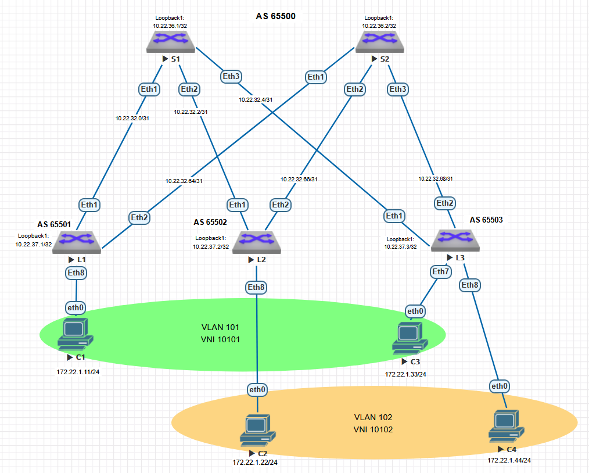
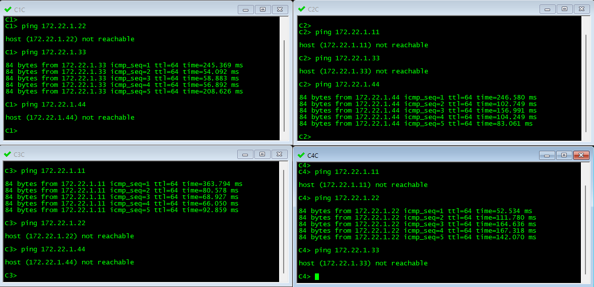

# Лабораторная работа №5

## VxLAN. L2 VNI

### Цель:

Настроить Overlay на основе VxLAN EVPN для L2 связанности между клиентами.


### Выполнение


Для настройки Overlay будем использовать Underlay сеть на базе eBGP, разработанную в [лабораторной работе №4](https://github.com/i-gershuni/OTUS-DC-NET-Design-Labs/tree/b2a99f9726f1776b0ebc7161b5cabc3d8a9d986b/Lab4).

Для данной работы удалим на Leaf коммутаторах клиентские IP подсети и примем следущие вводные для уточнения задачи: 
Клиенты C1 и С3 находятся в первом L2 домене, клиенты C2 и С4 во втором. Нам необходимо обеспечить, чтобы клиенты в одном L2 домене видели друг друга, но не видели клиентов в другом домене. 

Схема сети, используемая в данной работе, представлена на рисунке ниже.




### IPv4 адресация, используемая в данной работе


IPv4 адресация PtP интерфейсов нас в данной работе не интересует, поэтому ее здесь приводить не будем (но данные доступны в предыдущей работе по ссылке выше).


#### Адреса Loopback интерфейсов:

|  Spine |	S1 | S2 |
|-------------|---------------|---------------|
| loopback | 10.22.36.1/32 | 10.22.36.2/32 |

|  Leaf |	L1 | L2 | L3 |
|-------------|---------------|---------------|------------|
| loopback |	10.22.37.1/32 | 10.22.37.2/32 | 10.22.37.3/32 |

Всех клиентов поместим в одну подсеть 172.22.1.0/24.

#### Настройки IP на клиентских устройствах:

| Client | IP Addr | Def GW |
|---|---|---|
| **C1** | 172.22.1.11/24 | 172.22.1.1 |
| **C2** | 172.22.1.22/24 | 172.22.1.1 |
| **C3** | 172.22.1.33/24 | 172.22.1.1 |
| **C4** | 172.22.1.44/24 | 172.22.1.1 |

На всех коммутаторах у нас настроен Underlay на eBGP, номера AS на коммутаторах приведены в следующей таблице:

| Коммутатор | Номер AS |
|-----------|----------|
| Spine S1 | 6500 |
| Spine S2 | 6500 |
| Leaf L1 | 6501 |
| Leaf L2 | 6502 |
| Leaf L3 | 6503 |


### Выполняем настройки на коммутаторах:

Согласно полученным рекомендациям на всех коммутаторах включаем `service routing protocols model multi-agent`.

#### Настраиваем интерфейсы клиентские VLAN

Добавляем на коммутаторах клиентские VLAN:

| VLAN ID | Устройство | Подключенные клиенты |
|---|---|---|
| 101 | L1,L3 | C1,C3 |
| 102 | L2,L3 | C2,C4 |

Добавим клиентские порты как access к соответствующим VLAN.

#### Настраиваем VxLAN интерфейс:

На Leaf коммутаторах создаем интерфейс Vxlan 1, к нему добавляем клиентские VLAN и привязываем их к VNI согласно следующей таблице:
| Коммутатор | VLAN | VNI |
|---|---|---|
| L1 | 101 | 10101 |
| L2 | 102 | 10102 |
| L1 | 101,102 | 10101,10102 |

#### Настраиваем BGP EVPN

К уже существующей на коммутаторах конфигурации router bgp добавляем настройки для Overlay сети:

##### На Leaf коммутаторах:
Создаем новую peer group OVERLAY, для которой настраиваем remote-as, BFD, авторизацию и out-delay аналогично группе UNDERLAY, а кроме того для peer group OVERLAY:
- указываем интерфейс для отправки апдейтов `update source loopback 1`;
- настраиваем multihop `ebgp-multihop 2`;
- включаем отправку расширенных community `send-community extended`;
- добавляем loopback адреса Spine коммутаторв в качестве OVERLAY соседей.

Создаем MAC-IP VRF, настраиваем RD и RT согласно таблице:

| Коммутатор | VLAN | RD | RT |
|---|---|---|---|
| L1 | 101 | 65501:101 | both 65500:10101 |
| L2 | 102 | 65502:102 | both 65500:10102 |
| L3 | 101 | 65503:101 | both 65500:10101 |
| L1 | 102 | 65503:102 | both 65500:10102 |

*RD можно указать auto и в таком виде тоже работает, но Arista рекомендует указывать RD в явном виде, и команда `show bgp evpn sanity` выдает предупреждение, если RD не настроен, поэтому не поленимся и настроим его по своему вкусу в формате AS:VLAN_ID.*

Так же включим `redistribute learned` для каждого MAC-IP VRF.

В конце добавляем `address-family evpn`, и в ней активируем группу OVERLAY. 


##### На Spine коммутаторах:

Создаем новую peer group OVERLAY, для которой настраиваем remote-as, BFD, авторизацию и out-delay аналогично группе UNDERLAY, а кроме того для peer group OVERLAY:
- указываем интерфейс для отправки апдейтов `update source loopback 1`;
- настраиваем multihop `ebgp-multihop 2`;
- настраиваем `next-hop-unchanged`;
- включаем отправку расширенных community `send-community extended`;
- чтобы не прописывать каждый Leaf отдельно, создаем  `bgp listen range` на диапазон loopback-адресов Leaf коммутаторов для as-range 65501-65532.


В конце добавляем `address-family evpn`, и в ней активируем группу OVERLAY. 


### Итоговые настройки коммутаторов:

#### Настройки коммутатора S1:
```
service routing protocols model multi-agent
!
hostname S1
!
interface Ethernet1
   description Leaf1_Et1
   mtu 9214
   no switchport
   ip address 10.22.32.0/31
!
interface Ethernet2
   description Leaf2_Et1
   mtu 9214
   no switchport
   ip address 10.22.32.2/31
!
interface Ethernet3
   description Leaf3_Et1
   mtu 9214
   no switchport
   ip address 10.22.32.4/31
!
interface Loopback1
   ip address 10.22.36.1/32
!

ip routing
no ip icmp redirect
!
peer-filter LEAVES
   10 match as-range 65501-65532 result accept
!
router bgp 65500
   router-id 10.22.36.1
   no bgp default ipv4-unicast
   timers bgp 1 3
   distance bgp 20 200 200
   maximum-paths 2 ecmp 2
   bgp listen range 10.22.37.0/24 peer-group OVERLAY peer-filter LEAVES
   bgp listen range 10.22.32.0/22 peer-group UNDERLAY peer-filter LEAVES
   neighbor OVERLAY peer group
   neighbor OVERLAY next-hop-unchanged
   neighbor OVERLAY out-delay 0
   neighbor OVERLAY update-source Loopback1
   neighbor OVERLAY bfd
   neighbor OVERLAY ebgp-multihop 2
   neighbor OVERLAY password 7 oNsKUXVXX/DkdbYvVeGk2A==
   neighbor OVERLAY send-community extended
   neighbor UNDERLAY peer group
   neighbor UNDERLAY out-delay 0
   neighbor UNDERLAY bfd
   neighbor UNDERLAY password 7 53+Z/5nyraWpgmFBkp2aHQ==
   !
   address-family evpn
      neighbor OVERLAY activate
   !
   address-family ipv4
      neighbor UNDERLAY activate
      network 10.22.36.1/32
!
end
```

#### Настройки коммутатора S2:
```
service routing protocols model multi-agent
!
hostname S2
!
interface Ethernet1
   description Leaf1_Et2
   mtu 9214
   no switchport
   ip address 10.22.32.64/31
!
interface Ethernet2
   description Leaf2_Et2
   mtu 9214
   no switchport
   ip address 10.22.32.66/31
!
interface Ethernet3
   description Leaf3_Et2
   mtu 9214
   no switchport
   ip address 10.22.32.68/31
!
interface Loopback1
   ip address 10.22.36.2/32
!
ip routing
no ip icmp redirect
!
peer-filter LEAVES
   10 match as-range 65501-65532 result accept
!
router bgp 65500
   router-id 10.22.36.2
   no bgp default ipv4-unicast
   timers bgp 1 3
   distance bgp 20 200 200
   maximum-paths 2 ecmp 2
   bgp listen range 10.22.37.0/24 peer-group OVERLAY peer-filter LEAVES
   bgp listen range 10.22.32.0/22 peer-group UNDERLAY peer-filter LEAVES
   neighbor OVERLAY peer group
   neighbor OVERLAY next-hop-unchanged
   neighbor OVERLAY out-delay 0
   neighbor OVERLAY update-source Loopback1
   neighbor OVERLAY bfd
   neighbor OVERLAY ebgp-multihop 2
   neighbor OVERLAY password 7 oNsKUXVXX/DkdbYvVeGk2A==
   neighbor OVERLAY send-community extended
   neighbor UNDERLAY peer group
   neighbor UNDERLAY out-delay 0
   neighbor UNDERLAY bfd
   neighbor UNDERLAY password 7 53+Z/5nyraWpgmFBkp2aHQ==
   !
   address-family evpn
      neighbor OVERLAY activate
   !
   address-family ipv4
      neighbor UNDERLAY activate
      network 10.22.36.2/32
!
end
```

#### Настройки коммутатора L1:
```
service routing protocols model multi-agent
!
hostname L1
!
vlan 101
   name Zone1
!
interface Ethernet1
   description Spoke1_Et1
   mtu 9214
   no switchport
   ip address 10.22.32.1/31
!
interface Ethernet2
   description Spoke2_Et1
   mtu 9214
   no switchport
   ip address 10.22.32.65/31
!
interface Ethernet8
   description Client1
   switchport access vlan 101
!
interface Loopback1
   ip address 10.22.37.1/32
!
interface Vxlan1
   vxlan source-interface Loopback1
   vxlan udp-port 4789
   vxlan vlan 101 vni 10101
!
ip routing
no ip icmp redirect
!
router bgp 65501
   router-id 10.22.37.1
   no bgp default ipv4-unicast
   timers bgp 1 3
   distance bgp 20 200 200
   maximum-paths 2 ecmp 2
   neighbor OVERLAY peer group
   neighbor OVERLAY remote-as 65500
   neighbor OVERLAY out-delay 0
   neighbor OVERLAY update-source Loopback1
   neighbor OVERLAY bfd
   neighbor OVERLAY ebgp-multihop 2
   neighbor OVERLAY password 7 oNsKUXVXX/DkdbYvVeGk2A==
   neighbor OVERLAY send-community extended
   neighbor UNDERLAY peer group
   neighbor UNDERLAY remote-as 65500
   neighbor UNDERLAY out-delay 0
   neighbor UNDERLAY bfd
   neighbor UNDERLAY password 7 53+Z/5nyraWpgmFBkp2aHQ==
   neighbor 10.22.32.0 peer group UNDERLAY
   neighbor 10.22.32.64 peer group UNDERLAY
   neighbor 10.22.36.1 peer group OVERLAY
   neighbor 10.22.36.2 peer group OVERLAY
   !
   vlan 101
      rd 65501:101
      route-target both 65500:10101
      redistribute learned
   !
   address-family evpn
      neighbor OVERLAY activate
   !
   address-family ipv4
      neighbor UNDERLAY activate
      network 10.22.37.1/32
!
end
```

#### Настройки коммутатора L2:
```
service routing protocols model multi-agent
!
hostname L2
!

vlan 102
   name Zone2
!
interface Ethernet1
   description Spine1_Et2
   mtu 9214
   no switchport
   ip address 10.22.32.3/31
!
interface Ethernet2
   description Spine2_Et2
   mtu 9214
   no switchport
   ip address 10.22.32.67/31
!
interface Ethernet8
   description Client2
   switchport access vlan 102
!
interface Loopback1
   ip address 10.22.37.2/32
!
interface Vxlan1
   vxlan source-interface Loopback1
   vxlan udp-port 4789
   vxlan vlan 102 vni 10102
!
ip routing
no ip icmp redirect
!
router bgp 65502
   router-id 10.22.37.2
   no bgp default ipv4-unicast
   timers bgp 1 3
   distance bgp 20 200 200
   maximum-paths 2 ecmp 2
   neighbor OVERLAY peer group
   neighbor OVERLAY remote-as 65500
   neighbor OVERLAY out-delay 0
   neighbor OVERLAY update-source Loopback1
   neighbor OVERLAY bfd
   neighbor OVERLAY ebgp-multihop 2
   neighbor OVERLAY password 7 oNsKUXVXX/DkdbYvVeGk2A==
   neighbor OVERLAY send-community extended
   neighbor UNDERLAY peer group
   neighbor UNDERLAY remote-as 65500
   neighbor UNDERLAY out-delay 0
   neighbor UNDERLAY bfd
   neighbor UNDERLAY password 7 53+Z/5nyraWpgmFBkp2aHQ==
   neighbor 10.22.32.2 peer group UNDERLAY
   neighbor 10.22.32.66 peer group UNDERLAY
   neighbor 10.22.36.1 peer group OVERLAY
   neighbor 10.22.36.2 peer group OVERLAY
   !
   vlan 102
      rd 65502:102
      route-target both 65500:10102
      redistribute learned
   !
   address-family evpn
      neighbor OVERLAY activate
   !
   address-family ipv4
      neighbor UNDERLAY activate
      network 10.22.37.2/32
!
end
```

#### Настройки коммутатора L3:
```
service routing protocols model multi-agent
!
hostname L3
!
vlan 101
   name Zone1
!
vlan 102
   name Zone2
!
interface Ethernet1
   description Spine1_Et3
   mtu 9214
   no switchport
   ip address 10.22.32.5/31
!
interface Ethernet2
   description Spine2_Et3
   mtu 9214
   no switchport
   ip address 10.22.32.69/31
!
interface Ethernet7
   description Client3
   switchport access vlan 101
!
interface Ethernet8
   description Client4
   switchport access vlan 102
!
interface Loopback1
   ip address 10.22.37.3/32
!
interface Vxlan1
   vxlan source-interface Loopback1
   vxlan udp-port 4789
   vxlan vlan 101 vni 10101
   vxlan vlan 102 vni 10102
!
ip routing
no ip icmp redirect
!
router bgp 65503
   router-id 10.22.37.3
   no bgp default ipv4-unicast
   timers bgp 1 3
   distance bgp 20 200 200
   maximum-paths 2 ecmp 2
   neighbor OVERLAY peer group
   neighbor OVERLAY remote-as 65500
   neighbor OVERLAY out-delay 0
   neighbor OVERLAY update-source Loopback1
   neighbor OVERLAY bfd
   neighbor OVERLAY ebgp-multihop 2
   neighbor OVERLAY password 7 oNsKUXVXX/DkdbYvVeGk2A==
   neighbor OVERLAY send-community extended
   neighbor UNDERLAY peer group
   neighbor UNDERLAY remote-as 65500
   neighbor UNDERLAY out-delay 0
   neighbor UNDERLAY bfd
   neighbor UNDERLAY password 7 53+Z/5nyraWpgmFBkp2aHQ==
   neighbor 10.22.32.4 peer group UNDERLAY
   neighbor 10.22.32.68 peer group UNDERLAY
   neighbor 10.22.36.1 peer group OVERLAY
   neighbor 10.22.36.2 peer group OVERLAY
   !
   vlan 101
      rd 65503:101
      route-target both 65500:10101
      redistribute learned
   !
   vlan 102
      rd 65503:102
      route-target both 65500:10102
      redistribute learned
   !
   address-family evpn
      neighbor OVERLAY activate
   !
   address-family ipv4
      neighbor UNDERLAY activate
      network 10.22.37.3/32
!
end
``` 

***

### Проверка результатов

##### Проверяем настройки адресов на интерфейсах:


##### Проверяем BGP соседство, полученные по BGP маршруты, обращаем внимание на наличие двух ECMP маршрутов до слиентских подсетей на Leaf'ах :


#### Проверяем итоговую таблицу маршрутизации:


##### Проверяем связность по IPv4 между клиентскими устройствами, выполнив ***ping*** с каждого устройства до всех его соседей:



***

## Все работает как и было задумано!

