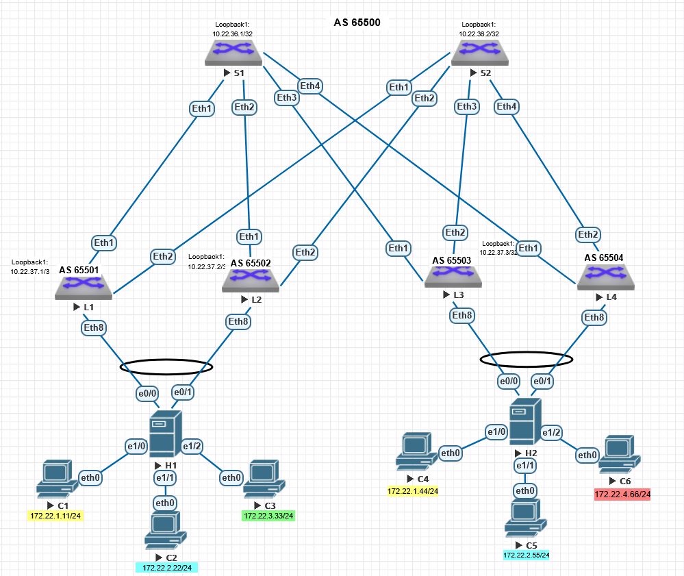
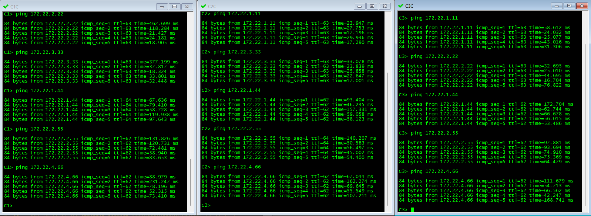
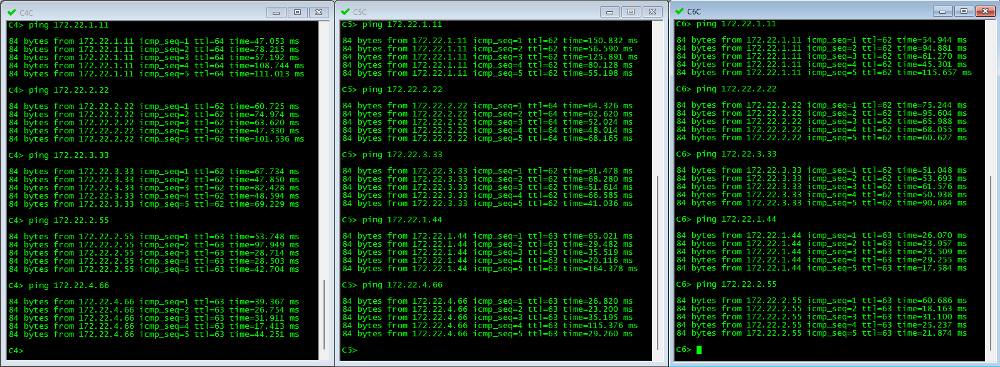

# Лабораторная работа №7

## VXLAN. Multihoming

### Цель:

Настроить отказоустойчивое подключение клиентов с использованием EVPN Multihoming.


### Выполнение


В данной работе мы будем использовать сеть, настроенную в [лабораторной работе №6](https://github.com/i-gershuni/OTUS-DC-NET-Design-Labs/tree/2c2b5cdc0e58954c3908f0fb848281f1ae80adcf/Lab6), но с некторыми изменениями:
- добавим еще один Leaf коммутатор;
- добавим два дополнительных L2 коммутатора, которые будут изображать серверы хостов виртуализации, включенные агрегированным портом в два разных Leaf коммутатора.  Клиенские PC включим в эти "хосты" в роли виртуальных машин.


Схема сети, используемая в данной работе, представлена на рисунке ниже.




### IPv4 адресация, используемая в данной работе

#### Адреса Loopback интерфейсов:

|  Spine |	S1 | S2 |
|-------------|---------------|---------------|
| loopback | 10.22.36.1/32 | 10.22.36.2/32 |

|  Leaf |	L1 | L2 | L3 | L4 |
|-------------|---------------|---------------|------------|------------|
| loopback |	10.22.37.1/32 | 10.22.37.2/32 | 10.22.37.3/32 | 10.22.37.4/32 |

На всех коммутаторах у нас настроен Underlay на eBGP, номера AS на коммутаторах приведены в следующей таблице:

| Коммутатор | Номер AS |
|-----------|----------|
| Spine S1 | 6500 |
| Spine S2 | 6500 |
| Leaf L1 | 6501 |
| Leaf L2 | 6502 |
| Leaf L3 | 6503 |
| Leaf L4 | 6504 |

На всех Leaf настроим одинаковый набор VNI, так же соответствующие VLAN настроим на "хостах": 

| VLAN | VNI |
|---|---|
| 101 | 10101 |
| 102 | 10102 |
| 103 | 10103 |
| 104 | 10104 |

#### Настройки IP на клиентских устройствах:

| Client | IP Addr | Def GW | VLAN |
|---|---|---|
| **C1** | 172.22.1.11/24 | 172.22.1.1 | 101 |
| **C2** | 172.22.2.22/24 | 172.22.2.1 | 102 |
| **C3** | 172.22.3.33/24 | 172.22.3.1 | 103 |
| **C4** | 172.22.1.44/24 | 172.22.1.1 | 101 |
| **C5** | 172.22.2.55/24 | 172.22.2.1 | 102 |
| **C6** | 172.22.4.66/24 | 172.22.4.1 | 104 |

### Выполняем настройки на коммутаторах:

На всех Leaf коммутаторах создадим агрегированный порт Port-channel 1 в режиме транка. Добавим к нему порт, к которому подключен "хост" (Ethernet8).
Для организации Multihoming настроим на Po1 evpn ethernet-segment и lacp system-id следующим образом:


|Параметр | L1 | L2 | L3 | L4 |
|identifier | 0000:0000:0000:0102:0001 | 0000:0000:0000:0102:0001 | 0000:0000:0000:0304:0001 | 0000:0000:0000:0304:0001 |
|route-target | 00:00:00:01:02:01 | 00:00:00:01:02:01 | 00:00:00:03:04:01 | 00:00:00:03:04:01 |
|df preference | 100 | 50 | 100 | 50 |
|lacp system-id | 1eaf.0102.0001 | 1eaf.0102.0001 |  1eaf.0304.0001 |  1eaf.0304.0001 |


### Итоговые настройки Leaf коммутаторов (настройки Spine в данной работе не менялись, поэтому их опустим):

#### Настройки коммутатора L1:
```
hostname L1
!
spanning-tree mode mstp
!
vlan 101
   name Zone1
!
vlan 102
   name Zone2
!
vlan 103
   name Zone3
!
vlan 104
   name Zone4
!
vrf instance L3VNI
!
interface Port-Channel1
   description Host 1
   switchport trunk allowed vlan 101-104
   switchport mode trunk
   !
   evpn ethernet-segment
      identifier 0000:0000:0000:0102:0001
      designated-forwarder election algorithm preference 100
      route-target import 00:00:00:01:02:01
   lacp system-id 1eaf.0102.0001
   spanning-tree bpdufilter enable
!
interface Port-Channel2
!
interface Ethernet1
   description Spoke1_Et1
   mtu 9214
   no switchport
   ip address 10.22.32.1/31
!
interface Ethernet2
   description Spoke2_Et1
   mtu 9214
   no switchport
   ip address 10.22.32.65/31
!
interface Ethernet3
!
interface Ethernet4
!
interface Ethernet5
!
interface Ethernet6
!
interface Ethernet7
!
interface Ethernet8
   description Host1_et0/0
   channel-group 1 mode active
!
interface Loopback1
   ip address 10.22.37.1/32
!
interface Management1
!
interface Vlan101
   vrf L3VNI
   ip address virtual 172.22.1.1/24
!
interface Vlan102
   vrf L3VNI
   ip address virtual 172.22.2.1/24
!
interface Vlan103
   vrf L3VNI
   ip address virtual 172.22.3.1/24
!
interface Vlan104
   vrf L3VNI
   ip address virtual 172.22.4.1/24
!
interface Vxlan1
   vxlan source-interface Loopback1
   vxlan udp-port 4789
   vxlan vlan 101 vni 10101
   vxlan vlan 102 vni 10102
   vxlan vlan 103 vni 10103
   vxlan vlan 104 vni 10104
   vxlan vrf L3VNI vni 90000
!
ip virtual-router mac-address 02:00:00:00:1e:af
!
ip routing
no ip icmp redirect
ip routing vrf L3VNI
!
router bgp 65501
   router-id 10.22.37.1
   no bgp default ipv4-unicast
   distance bgp 20 200 200
   maximum-paths 2 ecmp 2
   neighbor OVERLAY peer group
   neighbor OVERLAY remote-as 65500
   neighbor OVERLAY out-delay 0
   neighbor OVERLAY update-source Loopback1
   neighbor OVERLAY ebgp-multihop 2
   neighbor OVERLAY password 7 oNsKUXVXX/DkdbYvVeGk2A==
   neighbor OVERLAY send-community extended
   neighbor UNDERLAY peer group
   neighbor UNDERLAY remote-as 65500
   neighbor UNDERLAY out-delay 0
   neighbor UNDERLAY password 7 53+Z/5nyraWpgmFBkp2aHQ==
   neighbor 10.22.32.0 peer group UNDERLAY
   neighbor 10.22.32.64 peer group UNDERLAY
   neighbor 10.22.36.1 peer group OVERLAY
   neighbor 10.22.36.2 peer group OVERLAY
   !
   vlan 101
      rd 65501:101
      route-target both 65500:10101
      redistribute learned
   !
   vlan 102
      rd 65501:102
      route-target both 65500:10102
      redistribute learned
   !
   vlan 103
      rd 65501:103
      route-target both 65500:10103
      redistribute learned
   !
   vlan 104
      rd 65501:104
      route-target both 65500:10104
      redistribute learned
   !
   address-family evpn
      neighbor OVERLAY activate
   !
   address-family ipv4
      neighbor UNDERLAY activate
      network 10.22.37.1/32
   !
   vrf L3VNI
      rd 65501:1
      route-target import evpn 6500:90000
      route-target export evpn 6500:90000
      redistribute connected
!
end
```

#### Настройки коммутатора L2:
```
hostname L2
!
spanning-tree mode mstp
!
vlan 101
   name Zone1
!
vlan 102
   name Zone2
!
vlan 103
   name Zone3
!
vlan 104
   name Zone4
!
vrf instance L3VNI
!
interface Port-Channel1
   description Host 1
   switchport trunk allowed vlan 101-104
   switchport mode trunk
   !
   evpn ethernet-segment
      identifier 0000:0000:0000:0102:0001
      designated-forwarder election algorithm preference 50
      route-target import 00:00:00:01:02:01
   lacp system-id 1eaf.0102.0001
   spanning-tree bpdufilter enable
!
interface Ethernet1
   description Spine1_Et2
   mtu 9214
   no switchport
   ip address 10.22.32.3/31
!
interface Ethernet2
   description Spine2_Et2
   mtu 9214
   no switchport
   ip address 10.22.32.67/31
!
interface Ethernet3
!
interface Ethernet4
!
interface Ethernet5
!
interface Ethernet6
!
interface Ethernet7
!
interface Ethernet8
   description Host1_et0/1
   channel-group 1 mode active
!
interface Loopback1
   ip address 10.22.37.2/32
!
interface Management1
!
interface Vlan101
   vrf L3VNI
   ip address virtual 172.22.1.1/24
!
interface Vlan102
   vrf L3VNI
   ip address virtual 172.22.2.1/24
!
interface Vlan103
   vrf L3VNI
   ip address virtual 172.22.3.1/24
!
interface Vlan104
   vrf L3VNI
   ip address virtual 172.22.4.1/24
!
interface Vxlan1
   vxlan source-interface Loopback1
   vxlan udp-port 4789
   vxlan vlan 101 vni 10101
   vxlan vlan 102 vni 10102
   vxlan vlan 103 vni 10103
   vxlan vlan 104 vni 10104
   vxlan vrf L3VNI vni 90000
!
ip virtual-router mac-address 02:00:00:00:1e:af
!
ip routing
no ip icmp redirect
ip routing vrf L3VNI
!
router bgp 65502
   router-id 10.22.37.2
   no bgp default ipv4-unicast
   distance bgp 20 200 200
   maximum-paths 2 ecmp 2
   neighbor OVERLAY peer group
   neighbor OVERLAY remote-as 65500
   neighbor OVERLAY out-delay 0
   neighbor OVERLAY update-source Loopback1
   neighbor OVERLAY ebgp-multihop 2
   neighbor OVERLAY password 7 oNsKUXVXX/DkdbYvVeGk2A==
   neighbor OVERLAY send-community extended
   neighbor UNDERLAY peer group
   neighbor UNDERLAY remote-as 65500
   neighbor UNDERLAY out-delay 0
   neighbor UNDERLAY password 7 53+Z/5nyraWpgmFBkp2aHQ==
   neighbor 10.22.32.2 peer group UNDERLAY
   neighbor 10.22.32.66 peer group UNDERLAY
   neighbor 10.22.36.1 peer group OVERLAY
   neighbor 10.22.36.2 peer group OVERLAY
   !
   vlan 101
      rd 65502:101
      route-target both 65500:10101
      redistribute learned
   !
   vlan 102
      rd 65502:102
      route-target both 65500:10102
      redistribute learned
   !
   vlan 103
      rd 65502:103
      route-target both 65500:10103
      redistribute learned
   !
   vlan 104
      rd 65502:104
      route-target both 65500:10104
      redistribute learned
   !
   address-family evpn
      neighbor OVERLAY activate
   !
   address-family ipv4
      neighbor UNDERLAY activate
      network 10.22.37.2/32
   !
   vrf L3VNI
      rd 65502:1
      route-target import evpn 6500:90000
      route-target export evpn 6500:90000
      redistribute connected
!
end
```

#### Настройки коммутатора L3:
```
hostname L3
!
spanning-tree mode mstp
!
vlan 101
   name Zone1
!
vlan 102
   name Zone2
!
vlan 103
   name Zone3
!
vlan 104
   name Zone4
!
vrf instance L3VNI
!
interface Port-Channel1
   description Host 2
   switchport trunk allowed vlan 101-104
   switchport mode trunk
   !
   evpn ethernet-segment
      identifier 0000:0000:0000:0304:0001
      designated-forwarder election algorithm preference 100
      route-target import 00:00:00:03:04:01
   lacp system-id 1eaf.0304.0001
   spanning-tree bpduguard enable
!
interface Ethernet1
   description Spine1_Et3
   mtu 9214
   no switchport
   ip address 10.22.32.5/31
!
interface Ethernet2
   description Spine2_Et3
   mtu 9214
   no switchport
   ip address 10.22.32.69/31
!
interface Ethernet3
!
interface Ethernet4
!
interface Ethernet5
!
interface Ethernet6
!
interface Ethernet7
!
interface Ethernet8
   description Host2_et0/0
   channel-group 1 mode active
!
interface Loopback1
   ip address 10.22.37.3/32
!
interface Management1
!
interface Vlan101
   vrf L3VNI
   ip address virtual 172.22.1.1/24
!
interface Vlan102
   vrf L3VNI
   ip address virtual 172.22.2.1/24
!
interface Vlan103
   vrf L3VNI
   ip address virtual 172.22.3.1/24
!
interface Vlan104
   vrf L3VNI
   ip address virtual 172.22.4.1/24
!
interface Vxlan1
   vxlan source-interface Loopback1
   vxlan udp-port 4789
   vxlan vlan 101 vni 10101
   vxlan vlan 102 vni 10102
   vxlan vlan 103 vni 10103
   vxlan vlan 104 vni 10104
   vxlan vrf L3VNI vni 90000
!
ip virtual-router mac-address 02:00:00:00:1e:af
!
ip routing
no ip icmp redirect
ip routing vrf L3VNI
!
router bgp 65503
   router-id 10.22.37.3
   no bgp default ipv4-unicast
   distance bgp 20 200 200
   maximum-paths 2 ecmp 2
   neighbor OVERLAY peer group
   neighbor OVERLAY remote-as 65500
   neighbor OVERLAY out-delay 0
   neighbor OVERLAY update-source Loopback1
   neighbor OVERLAY ebgp-multihop 2
   neighbor OVERLAY password 7 oNsKUXVXX/DkdbYvVeGk2A==
   neighbor OVERLAY send-community extended
   neighbor UNDERLAY peer group
   neighbor UNDERLAY remote-as 65500
   neighbor UNDERLAY out-delay 0
   neighbor UNDERLAY password 7 53+Z/5nyraWpgmFBkp2aHQ==
   neighbor 10.22.32.4 peer group UNDERLAY
   neighbor 10.22.32.68 peer group UNDERLAY
   neighbor 10.22.36.1 peer group OVERLAY
   neighbor 10.22.36.2 peer group OVERLAY
   !
   vlan 101
      rd 65503:101
      route-target both 65500:10101
      redistribute learned
   !
   vlan 102
      rd 65503:102
      route-target both 65500:10102
      redistribute learned
   !
   vlan 103
      rd 65503:103
      route-target both 65500:10103
      redistribute learned
   !
   vlan 104
      rd 65503:104
      route-target both 65500:10104
      redistribute learned
   !
   address-family evpn
      neighbor OVERLAY activate
   !
   address-family ipv4
      neighbor UNDERLAY activate
      network 10.22.37.3/32
   !
   vrf L3VNI
      rd 65503:1
      route-target import evpn 6500:90000
      route-target export evpn 6500:90000
      redistribute connected
!
end
``` 

#### Настройки коммутатора L4:
```
hostname L4
!
spanning-tree mode mstp
!
vlan 101
   name Zone1
!
vlan 102
   name Zone2
!
vlan 103
   name Zone3
!
vlan 104
   name Zone4
!
vrf instance L3VNI
!
interface Port-Channel1
   description Host 2
   switchport trunk allowed vlan 101-104
   switchport mode trunk
   !
   evpn ethernet-segment
      identifier 0000:0000:0000:0304:0001
      designated-forwarder election algorithm preference 50
      route-target import 00:00:00:03:04:01
   lacp system-id 1eaf.0304.0001
   spanning-tree bpduguard enable
!
interface Ethernet1
   description Spine1_Et4
   mtu 9214
   no switchport
   ip address 10.22.32.7/31
!
interface Ethernet2
   description Spine2_Et3
   mtu 9214
   no switchport
   ip address 10.22.32.71/31
!
interface Ethernet3
!
interface Ethernet4
!
interface Ethernet5
!
interface Ethernet6
!
interface Ethernet7
!
interface Ethernet8
   description Host2_et0/1
   channel-group 1 mode active
!
interface Loopback1
   ip address 10.22.37.4/32
!
interface Management1
!
interface Vlan101
   vrf L3VNI
   ip address virtual 172.22.1.1/24
!
interface Vlan102
   vrf L3VNI
   ip address virtual 172.22.2.1/24
!
interface Vlan103
   vrf L3VNI
   ip address virtual 172.22.3.1/24
!
interface Vlan104
   vrf L3VNI
   ip address virtual 172.22.4.1/24
!
interface Vxlan1
   vxlan source-interface Loopback1
   vxlan udp-port 4789
   vxlan vlan 101 vni 10101
   vxlan vlan 102 vni 10102
   vxlan vlan 103 vni 10103
   vxlan vlan 104 vni 10104
   vxlan vrf L3VNI vni 90000
!
ip virtual-router mac-address 02:00:00:00:1e:af
!
ip routing
no ip icmp redirect
ip routing vrf L3VNI
!
router bgp 65504
   router-id 10.22.37.4
   no bgp default ipv4-unicast
   distance bgp 20 200 200
   maximum-paths 2 ecmp 2
   neighbor OVERLAY peer group
   neighbor OVERLAY remote-as 65500
   neighbor OVERLAY out-delay 0
   neighbor OVERLAY update-source Loopback1
   neighbor OVERLAY ebgp-multihop 2
   neighbor OVERLAY password 7 oNsKUXVXX/DkdbYvVeGk2A==
   neighbor OVERLAY send-community extended
   neighbor UNDERLAY peer group
   neighbor UNDERLAY remote-as 65500
   neighbor UNDERLAY out-delay 0
   neighbor UNDERLAY password 7 53+Z/5nyraWpgmFBkp2aHQ==
   neighbor 10.22.32.6 peer group UNDERLAY
   neighbor 10.22.32.70 peer group UNDERLAY
   neighbor 10.22.36.1 peer group OVERLAY
   neighbor 10.22.36.2 peer group OVERLAY
   !
   vlan 101
      rd 65504:101
      route-target both 65500:10101
      redistribute learned
   !
   vlan 102
      rd 65504:102
      route-target both 65500:10102
      redistribute learned
   !
   vlan 103
      rd 65504:103
      route-target both 65500:10103
      redistribute learned
   !
   vlan 104
      rd 65504:104
      route-target both 65500:10104
      redistribute learned
   !
   address-family evpn
      neighbor OVERLAY activate
   !
   address-family ipv4
      neighbor UNDERLAY activate
      network 10.22.37.4/32
   !
   vrf L3VNI
      rd 65504:1
      route-target import evpn 6500:90000
      route-target export evpn 6500:90000
      redistribute connected
!
end
``` 

#### Настройки "хоста" H1:

```
hostname H1

interface Port-channel1
 switchport trunk encapsulation dot1q
 switchport mode trunk
 switchport nonegotiate
 spanning-tree bpdufilter enable
!
interface Ethernet0/0
 description Uplink1
 switchport trunk encapsulation dot1q
 switchport mode trunk
 switchport nonegotiate
 channel-group 1 mode active
!
interface Ethernet0/1
 description Uplink2
 switchport trunk encapsulation dot1q
 switchport mode trunk
 switchport nonegotiate
 channel-group 1 mode active
!
interface Ethernet1/0
 description Client1
 switchport access vlan 101
 switchport mode access
!
interface Ethernet1/1
 description Client2
 switchport access vlan 102
 switchport mode access
!
interface Ethernet1/2
 description Client3
 switchport access vlan 103
 switchport mode access
!
```

#### Настройки "хоста" H2:

```
hostname H2
!
interface Port-channel1
 switchport trunk encapsulation dot1q
 switchport mode trunk
 spanning-tree bpdufilter enable
!
interface Ethernet0/0
 description Uplink1
 switchport trunk encapsulation dot1q
 switchport mode trunk
 channel-group 1 mode active
!
interface Ethernet0/1
 description Uplink2
 switchport trunk encapsulation dot1q
 switchport mode trunk
 channel-group 1 mode active
!         
interface Ethernet1/0
 description Client4
 switchport access vlan 101
 switchport mode access
!
interface Ethernet1/1
 description Client5
 switchport access vlan 102
 switchport mode access
!
interface Ethernet1/2
 description Client6
 switchport access vlan 104
 switchport mode access
!
```


***

### Проверка результатов

##### Проверим связность между клиентскими устройствами с помощью ***ping***. Все клиенты видят друг друга, вне зависимости от того, находятся ли они в одном L2 домене или в разных: 




##### Посмотрим на EVPN маршруты (на примере L1):

###### Type-2 маршруты - по два ECMP маршрута до всех соседских VNI в наличии:
~~~
L1#show bgp evpn route-type imet
BGP routing table information for VRF default
Router identifier 10.22.37.1, local AS number 65501
Route status codes: * - valid, > - active, S - Stale, E - ECMP head, e - ECMP
                    c - Contributing to ECMP, % - Pending BGP convergence
Origin codes: i - IGP, e - EGP, ? - incomplete
AS Path Attributes: Or-ID - Originator ID, C-LST - Cluster List, LL Nexthop - Link Local Nexthop

          Network                Next Hop              Metric  LocPref Weight  Path
 * >      RD: 65501:101 imet 10.22.37.1
                                 -                     -       -       0       i
 * >      RD: 65501:102 imet 10.22.37.1
                                 -                     -       -       0       i
 * >Ec    RD: 65502:102 imet 10.22.37.2
                                 10.22.37.2            -       100     0       65500 65502 i
 *  ec    RD: 65502:102 imet 10.22.37.2
                                 10.22.37.2            -       100     0       65500 65502 i
 * >Ec    RD: 65502:104 imet 10.22.37.2
                                 10.22.37.2            -       100     0       65500 65502 i
 *  ec    RD: 65502:104 imet 10.22.37.2
                                 10.22.37.2            -       100     0       65500 65502 i
 * >Ec    RD: 65503:103 imet 10.22.37.3
                                 10.22.37.3            -       100     0       65500 65503 i
 *  ec    RD: 65503:103 imet 10.22.37.3
                                 10.22.37.3            -       100     0       65500 65503 i
 * >Ec    RD: 65503:104 imet 10.22.37.3
                                 10.22.37.3            -       100     0       65500 65503 i
 *  ec    RD: 65503:104 imet 10.22.37.3
                                 10.22.37.3            -       100     0       65500 65503 i
~~~

###### Type-3 маршруты - по два маршрута до MAC и IP всех соседей в наличии:
~~~
L1#show bgp evpn route-type mac-ip
BGP routing table information for VRF default
Router identifier 10.22.37.1, local AS number 65501
Route status codes: * - valid, > - active, S - Stale, E - ECMP head, e - ECMP
                    c - Contributing to ECMP, % - Pending BGP convergence
Origin codes: i - IGP, e - EGP, ? - incomplete
AS Path Attributes: Or-ID - Originator ID, C-LST - Cluster List, LL Nexthop - Link Local Nexthop

          Network                Next Hop              Metric  LocPref Weight  Path
 * >      RD: 65501:101 mac-ip 0050.7966.6803
                                 -                     -       -       0       i
 * >      RD: 65501:101 mac-ip 0050.7966.6803 172.22.1.11
                                 -                     -       -       0       i
 * >Ec    RD: 65502:102 mac-ip 0050.7966.6807
                                 10.22.37.2            -       100     0       65500 65502 i
 *  ec    RD: 65502:102 mac-ip 0050.7966.6807
                                 10.22.37.2            -       100     0       65500 65502 i
 * >Ec    RD: 65502:102 mac-ip 0050.7966.6807 172.22.2.22
                                 10.22.37.2            -       100     0       65500 65502 i
 *  ec    RD: 65502:102 mac-ip 0050.7966.6807 172.22.2.22
                                 10.22.37.2            -       100     0       65500 65502 i
 * >Ec    RD: 65503:104 mac-ip 0050.7966.6808
                                 10.22.37.3            -       100     0       65500 65503 i
 *  ec    RD: 65503:104 mac-ip 0050.7966.6808
                                 10.22.37.3            -       100     0       65500 65503 i
 * >Ec    RD: 65503:104 mac-ip 0050.7966.6808 172.22.4.44
                                 10.22.37.3            -       100     0       65500 65503 i
 *  ec    RD: 65503:104 mac-ip 0050.7966.6808 172.22.4.44
                                 10.22.37.3            -       100     0       65500 65503 i
 * >Ec    RD: 65503:103 mac-ip 0050.7966.6809
                                 10.22.37.3            -       100     0       65500 65503 i
 *  ec    RD: 65503:103 mac-ip 0050.7966.6809
                                 10.22.37.3            -       100     0       65500 65503 i
 * >Ec    RD: 65503:103 mac-ip 0050.7966.6809 172.22.3.33
                                 10.22.37.3            -       100     0       65500 65503 i
 *  ec    RD: 65503:103 mac-ip 0050.7966.6809 172.22.3.33
                                 10.22.37.3            -       100     0       65500 65503 i
 * >      RD: 65501:102 mac-ip 0050.7966.680a
                                 -                     -       -       0       i
 * >      RD: 65501:102 mac-ip 0050.7966.680a 172.22.2.55
                                 -                     -       -       0       i
 * >Ec    RD: 65502:104 mac-ip 0050.7966.680b
                                 10.22.37.2            -       100     0       65500 65502 i
 *  ec    RD: 65502:104 mac-ip 0050.7966.680b
                                 10.22.37.2            -       100     0       65500 65502 i
 * >Ec    RD: 65502:104 mac-ip 0050.7966.680b 172.22.4.66
                                 10.22.37.2            -       100     0       65500 65502 i
 *  ec    RD: 65502:104 mac-ip 0050.7966.680b 172.22.4.66
                                 10.22.37.2            -       100     0       65500 65502 i
~~~

###### Type-5 маршруты - по два маршрута до всех соседских подсетей в наличии:
~~~
L1#show bgp evpn route-type ip-prefix ipv4
BGP routing table information for VRF default
Router identifier 10.22.37.1, local AS number 65501
Route status codes: * - valid, > - active, S - Stale, E - ECMP head, e - ECMP
                    c - Contributing to ECMP, % - Pending BGP convergence
Origin codes: i - IGP, e - EGP, ? - incomplete
AS Path Attributes: Or-ID - Originator ID, C-LST - Cluster List, LL Nexthop - Link Local Nexthop

          Network                Next Hop              Metric  LocPref Weight  Path
 * >      RD: 65501:1 ip-prefix 172.22.1.0/24
                                 -                     -       -       0       i
 * >      RD: 65501:1 ip-prefix 172.22.2.0/24
                                 -                     -       -       0       i
 * >Ec    RD: 65502:1 ip-prefix 172.22.2.0/24
                                 10.22.37.2            -       100     0       65500 65502 i
 *  ec    RD: 65502:1 ip-prefix 172.22.2.0/24
                                 10.22.37.2            -       100     0       65500 65502 i
 * >Ec    RD: 65503:1 ip-prefix 172.22.3.0/24
                                 10.22.37.3            -       100     0       65500 65503 i
 *  ec    RD: 65503:1 ip-prefix 172.22.3.0/24
                                 10.22.37.3            -       100     0       65500 65503 i
 * >Ec    RD: 65502:1 ip-prefix 172.22.4.0/24
                                 10.22.37.2            -       100     0       65500 65502 i
 *  ec    RD: 65502:1 ip-prefix 172.22.4.0/24
                                 10.22.37.2            -       100     0       65500 65502 i
 * >Ec    RD: 65503:1 ip-prefix 172.22.4.0/24
                                 10.22.37.3            -       100     0       65500 65503 i
 *  ec    RD: 65503:1 ip-prefix 172.22.4.0/24
                                 10.22.37.3            -       100     0       65500 65503 i
~~~

##### Посмотрим таблицу маршрутизации для vrf L3VNI на L1, убедимся, что все маршруты до наших соседей в наличии и указывают на Vxlan интерфейс:
```
L1#show ip route vrf L3VNI

VRF: L3VNI
Codes: C - connected, S - static, K - kernel, 
       O - OSPF, IA - OSPF inter area, E1 - OSPF external type 1,
       E2 - OSPF external type 2, N1 - OSPF NSSA external type 1,
       N2 - OSPF NSSA external type2, B - Other BGP Routes,
       B I - iBGP, B E - eBGP, R - RIP, I L1 - IS-IS level 1,
       I L2 - IS-IS level 2, O3 - OSPFv3, A B - BGP Aggregate,
       A O - OSPF Summary, NG - Nexthop Group Static Route,
       V - VXLAN Control Service, M - Martian,
       DH - DHCP client installed default route,
       DP - Dynamic Policy Route, L - VRF Leaked,
       G  - gRIBI, RC - Route Cache Route

Gateway of last resort is not set

 C        172.22.1.0/24 is directly connected, Vlan101
 B E      172.22.2.22/32 [20/0] via VTEP 10.22.37.2 VNI 90000 router-mac 50:00:00:72:8b:31 local-interface Vxlan1
 C        172.22.2.0/24 is directly connected, Vlan102
 B E      172.22.3.33/32 [20/0] via VTEP 10.22.37.3 VNI 90000 router-mac 50:00:00:15:f4:e8 local-interface Vxlan1
 B E      172.22.3.0/24 [20/0] via VTEP 10.22.37.3 VNI 90000 router-mac 50:00:00:15:f4:e8 local-interface Vxlan1
 B E      172.22.4.44/32 [20/0] via VTEP 10.22.37.3 VNI 90000 router-mac 50:00:00:15:f4:e8 local-interface Vxlan1
 B E      172.22.4.66/32 [20/0] via VTEP 10.22.37.2 VNI 90000 router-mac 50:00:00:72:8b:31 local-interface Vxlan1
 B E      172.22.4.0/24 [20/0] via VTEP 10.22.37.3 VNI 90000 router-mac 50:00:00:15:f4:e8 local-interface Vxlan1
                               via VTEP 10.22.37.2 VNI 90000 router-mac 50:00:00:72:8b:31 local-interface Vxlan1
```


##### Посмотрим таблицу MAC на L1, убедимся, что мы видим MAC адрес клиента C2 за Vxlan интерфейсом:
```
L1#show mac address-table
          Mac Address Table
------------------------------------------------------------------

Vlan    Mac Address       Type        Ports      Moves   Last Move
----    -----------       ----        -----      -----   ---------
 101    0050.7966.6803    DYNAMIC     Et8        1       0:03:25 ago
 101    0200.0000.1eaf    STATIC      Cpu
 102    0050.7966.6807    DYNAMIC     Vx1        1       0:03:23 ago
 102    0050.7966.680a    DYNAMIC     Et7        1       0:01:02 ago
 102    0200.0000.1eaf    STATIC      Cpu
4094    0200.0000.1eaf    STATIC      Cpu
4094    5000.0015.f4e8    DYNAMIC     Vx1        1       2:20:20 ago
4094    5000.0072.8b31    DYNAMIC     Vx1        1       2:20:01 ago
Total Mac Addresses for this criterion: 8
```

***

## Цель работы достигнута, VxLAN EVPN для L3 связанности между клиентами настроен и работает.

