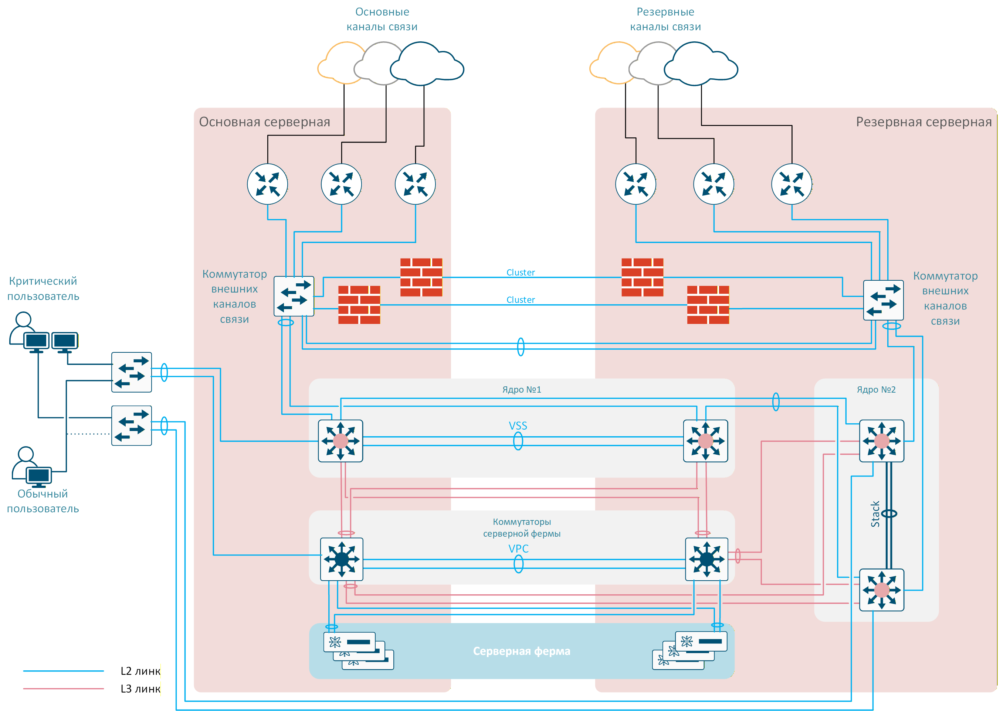
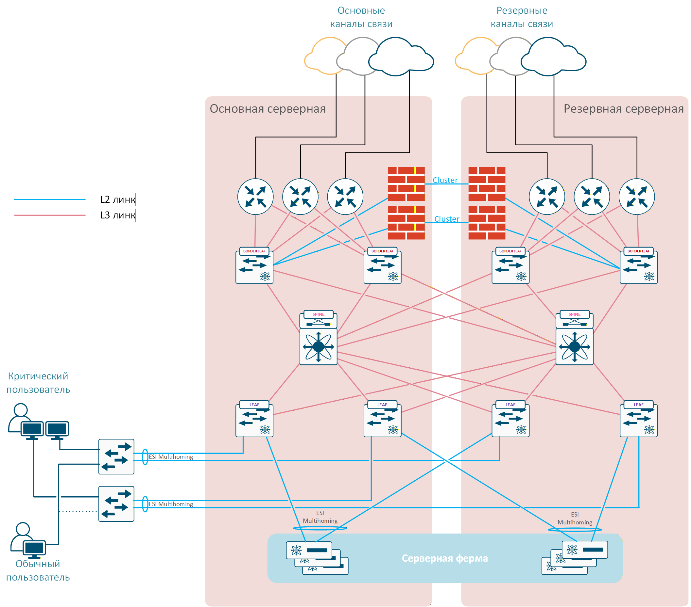
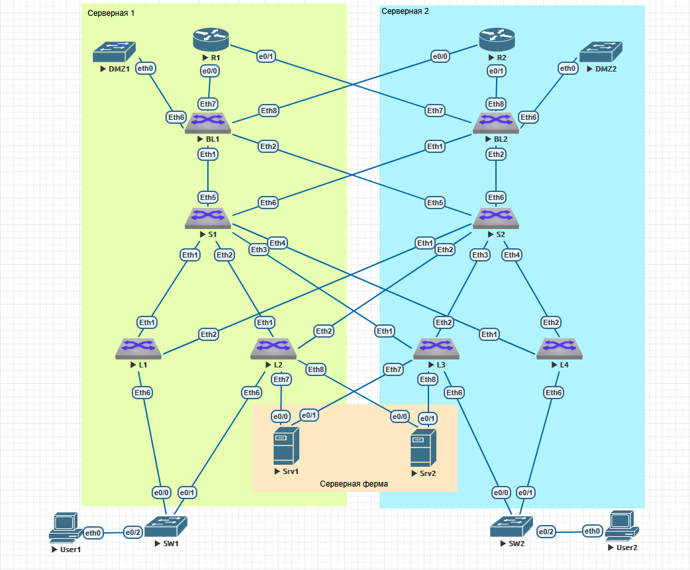

# Проектная работа

## Тема: Проектирование экстремально отказоустойчивой сети предприятия на базе технологии VxLAN EVPN

### Цель:

Целью работы является проработка вариантов модернизации существующей сети Предприятия, являющегося объектом критической инфраструктуры.

#### Исходные данные

Рассматривемая сеть Предприятия может быть описана следующими характеристиками:

 - все компоненты сети резервируются. В текущем варианте используется два ядра, разнесенных по разным серверным (в пределах здания либо в соседних зданиях). 
 - для подключения серверных ферм используется отдельный комплект коммутаторов в MLAG паре, подключенный L3 линками к обоим ядрам сети;
 - серверы в серверной ферме объединены в комплекс виртуализации, и разделены между серверными. Производительность комплекса рассчитана таким образом, чтобы каждый полукомплект мог запустить весь необходимый набор виртуальных машин. 
 - этажные коммутаторы так же дублируются, каждый коммутатор подключен к своему ядру. При этом критические пользователи имеют два рабочих места, каждое из которых подключено к своему коммутатору. Для обычных пользователей предусмотрена возможность оперативного переключения рабочего места между коммутаторами.
 - сеть имеет некоторое количество каналов связи к нижестоящим и вышестоящим филиалам, а так же выход в сеть Интернет. Все каналы связи дублируются через разных операторов связи. Так же дублируются все маршрутизаторы и МСЭ, используемые для подключения внешних каналов.

Основным требованием к сети является отказоустойчивость. Сервисы в сети должна сохранять работоспособность при:
 - отказе или выводе из эксплуатации любого коммутатора в сети;
 - полном отказе или выводе из эксплуатации одного из ядер сети;
 - одиночном отказе любого из линков;
 - отказе от одного до половины всех установленных серверов;
 - полном отключении одной серверной (отключение электропитания, пожар, потоп и т.п.). 

Допустимое максимальное время восстановления сервисов случае любого из вышеперечисленных сценарием составляет:
 - от 0 до 30 сек.  - отлично;
 - от 30 до 300 сек. - нежелательно, но приемлемо;
 - от 300 сек. и более - неприемлемо, рассматривается как серьезный инцидент.

При этом требования к производительности сети по нынешним меркам относительно невысоки, пропускной способности ядра в 100Gb/s более чем достаточно для текущих задач даже с перспективой роста в обозримом будущем.

 Имеющиеся проблемы и недостатки:
  - текущая версия сети простроена с использованием устаревшего оборудования Cisco. В нынешних условиях это ограничивает возможности расширения и модернизации ядра сети. 
  - текущая ситуация, в частности требования к импортозамещению оборудования, накладывает жесткие ограничения на выбор оборудования. Доступное оборудование не позволяет заменить ядро, построенное с использованием Cisco VSS, без ухудшения отказоустойчивости;
  - текущая топология сети имеет L2 петли. Протокол xSTP является источником потенциальных отказов по причине блокировки ядра сети при изменении топологии или проблемах с оборудованием.
 
Текущая схема сети Предприятия представлена на следующем рисунке:

#### Предлагаемое решение

В настоящем проекте рассматривается вариант построения сети с вышеописанными характеристиками с использованием топологии CLOS и технологии VxLAN EVPN. 
Топология CLOS (Spine-Leaf) — это идеальная физическая архитектура, обеспечивающая предсказуемую пропускную способность и отказоустойчивость. Технология VxLAN EVPN позволяет гибко и масштабируемо создавать изолированные L2- и L3-сервисы. 
Основные преимущества данной технологии для рассматриваемой задачи:

 - Отказоустойчивость: Выход из строя любого одного из коммутаторов не критичен. При необходимости коэффициент резервирования может быть увеличен путем добавления SPINE коммутаторов, при этом модернизация сети не потребует существенной перенастройки существующих коммутаторов или остановки сервисов. Использование технологии EVPN Multihoming позволяет резервировать подключение серверов, коммутаторов доступа, маршрутизаторов и МСЭ с возможностью терминации LACP линков на любых LEAF.
 - Гибкость: Возможность строить отказоустойчивые L2-домены, необходимые для как для кластеризации и миграции виртуальных машин, так и для работы других сервисов Предприятия, между любыми точками Underlay сети без использования протоколов группы STP, что нивелирует связанные ними риски. Возможность растяеуть L2 домен между разными площадками (например, при переезде филиала в новое здание);
 - Масштабируемость: возможность при необходимость увеличить емкость и/или производительность сети путем добавления Leaf или Spine коммутаторов без необходимости перенастройки существующей сети и остановки сервисов. 
 - Возможность изоляции трафика в разных VNI и VRF в масштабах сети позволяет разграничит внутренний трафик сети от внешнего;
 - Наличие коммутаторов производства РФ с поддержкой требуемой функциональности  (пример: Eltex MES5300-48 в качестве Leaf, MES5500-32 в качестве Spine).
 
Предлагаемая схема сети Предприятия с использованием топологии CLOS  и технологии VxLAN EVPM представлена на следующем рисунке:

-----

### Моделирование

В рамках настоящего проекта выполнено моделирование макета предлагаемой сети с использованием виртуальной лаборатории EVE-NG. За неимением возможности использовать в виртуальной лаборатории образы оборудования Eltex или других отечественных производителей для моделирования выбран образ коммутаторов ARISTA, как наиболее универсальный. 

Схема сети, реализованная, в лаборатории представлена на рисунке ниже:

#### Конфигурация оборудования

В качестве протокола маршрутизации Underlay сети выбран протокол IS-IS. В связи с ограниченной производительностью  виртуальной лаборатории в макете принято решение отказаться от использования протокола BFD, однако в реальной сети использование  данного протокола настоятельно рекомендуется.

IPv4 адресация для устройств на стенде приведена в таблицах ниже.

##### Подсети, выделенные для P2P интерфейсов:

| P2P |	L1 | L2 | L3 | L4 | BL1 | BL2 |
|---|----|---|---|----|---|---|
| **S1** | 10.22.32.0/31 | 10.22.32.2/31 | 10.22.32.4/31 | 10.22.32.6/31 | 10.22.32.8/31 | 10.22.32.10/31 |
| **S2** | 10.22.32.64/31 | 10.22.32.66/31 | 10.22.32.68/31 | 10.22.32.70/31 | 10.22.32.72/31 | 10.22.32.74/31 |

##### Адреса Loopback интерфейсов:

|  Spine |	S1 | S2 |
|-------------|---------------|---------------|
| loopback | 10.22.36.1/32 | 10.22.36.2/32 |

|  Leaf |	L1 | L2 | L3 | L4 | BL1 | BL2 |
|-------------|---------------|---------------|------------|---------------|---------------|------------|
| loopback |	10.22.37.1/32 | 10.22.37.2/32 | 10.22.37.3/32 | 10.22.37.4/32 | 10.22.37.5/32 | 10.22.37.6/32 |

Для Overlay использован протокол iBGP с номером AS 65500

##### В Overlay настроены следующие сервисы:

| Коммутатор | VLAN | VNI | Комментарий |
|---|---|---|---|
| L1,L2,L3,L4 | 100 | 10100 | Пользовательский VLAN #1 |
| L1,L2,L3,L4 | 101 | 10101 | Пользовательский VLAN #2 |
| L1,L2,L3,L4 | 200 | 10200 | Серверный VLAN #1 |
| L1,L2,L3,L4 | 201 | 10201 | Серверный VLAN #2 |
| BL1,BL2 | 500 | 10500 | Изолированный VLAN (DMZ) |
| BL1,BL2,L1,L2,L3,L4 | VRF INSIDE | 9000 | L3 VNI для маршрутизации внутреннего трафика |
| BL1,BL2 | VRF OUTSIDE | 9001 | L3 VNI для маршрутизации трафика между внешними каналами |

##### Настройки IP адресации серверов:

| Server | IP Addr | Def GW | VLAN | VRF |
|---|---|---|---|---|
| Srv1.VM1 | 172.22.200.100/24 | 172.22.200.1 | 200 | INSIDE |
| Srv1.VM2 | 172.22.201.100/24 | 172.22.201.1 | 201 | INSIDE|
| Srv2.VM1 | 172.22.200.101/24 | 172.22.200.1 | 200 | INSIDE |
| Srv2.VM2 | 172.22.201.101/24 | 172.22.201.1 | 201 | INSIDE|

##### Настройки IP адресации пользователей:

| User | IP Addr | Def GW | VLAN | VRF |
|---|---|---|---|---|
| User1 | 172.22.100.10/24 | 172.22.100.1 | 100 | INSIDE |
| User2 | 172.22.101.10/24 | 172.22.101.1 | 201 | INSIDE|

##### Для подключения коммутаторов доступа и серверов на Leaf настроен EVPN Multihoming:

| Device | Leaf | Port-channel | ES ID | LACP SysID | RT | Allowed VLANs |
|---|---|---|---|---|---|---|
| SW1 | L1,L2 | Po1 |  0000:0000:0000:0102:0001 | 1eaf.0102.0001 |  00:00:00:01:02:01 | 100-101 |
| SW2 | L3,L4 | Po2 |  0000:0000:0000:0304:0002 | 1eaf.0304.0002 |  00:00:00:03:04:02 | 100-101 |
| Srv1 | L2,L3 | Po11 |  0000:0000:0000:0203:0011 | 1eaf.0203.0011 |  00:00:00:02:03:11 | 200-201 |
| Srv2 | L2,L3 | Po12 |  0000:0000:0000:0203:0012 | 1eaf.0203.0012 |  00:00:00:02:03:12 | 200-201 |

##### Маршрутизаторы R1 и R2 служат для связи с внешними сетями. 

|  Router |	R1 | R2 |
|-------------|---------------|---------------|
| loopback | 110.1.1.1/32 | 10.2.2.2/32 |

##### Для их подключения к Border leaf использованы следующие PtP подсети:

 P2P | BL1 | BL2 |
|---|----|---|
| R1 | 10.50.1.0/31 | 10.50.1.4/31 | 
| R2 | 10.50.1.2/31 | 10.50.1.6/31 | 

Border leaf по eBGP анонсируют в сторону внешних сетей агрегированный маршрут 172.22.0.0.16, а от маршрутизаторов получает default route. 

-------------

### Конфигурация устройств:
 - [Коммутатор S1](./cfgs/S1.txt)
 - [Коммутатор S2](./cfgs/S2.txt)
 - [Коммутатор L1](./cfgs/L1.txt)
 - [Коммутатор L2](./cfgs/L2.txt)
 - [Коммутатор L3](./cfgs/L3.txt)
 - [Коммутатор L4](./cfgs/L4.txt)
 - [Коммутатор BL1](./cfgs/BL1.txt)
 - [Коммутатор BL2](./cfgs/BL2.txt)
 - [Коммутатор SW1](./cfgs/SW1.txt)
 - [Коммутатор SW2](./cfgs/SW2.txt)
 - [Сервер Srv1](./cfgs/Srv1.txt)
 - [Сервер Srv2](./cfgs/Srv2.txt)
 - [Маршрутизатор R1](./cfgs/R1.txt)
 - [Маршрутизатор R2](./cfgs/R2.txt)

--------------

##### Для проверки работоспособности созданной конфигурации, выполнив ***ping*** с пользовательских PC друг до друга, до каждой VM на серверах, и до внешних устройств: 

-------------

## Заключение
Использование технологии CLOS/VxLAN EVPN представляется весьма интересным вариантом для построения сетей предприятий с высокими требованиями к отказоустойчивости и имеет ряд преимуществ по сравнению с традиционной архитектурой.
В настоящем проекте выполнена базовая проработка данной концепции и выработаны основные архитектурные решения. 

Однако, в условиях виртуальной лаборатории невозможно протестировать функционал и качество реализации коммутаторов, являющихся потенциальными кандидатами на использовании в рассматриваемом решении. 
Так же ограничения виртуальной лаборатории не позволяют в полной мере протестировать отказоустойчивость решения для различных сценариев отказов. Поэтому, дальнейшая проработка концепции требует тщательного тестирования на реальном оборудовании конкретного производителя. 

-----------