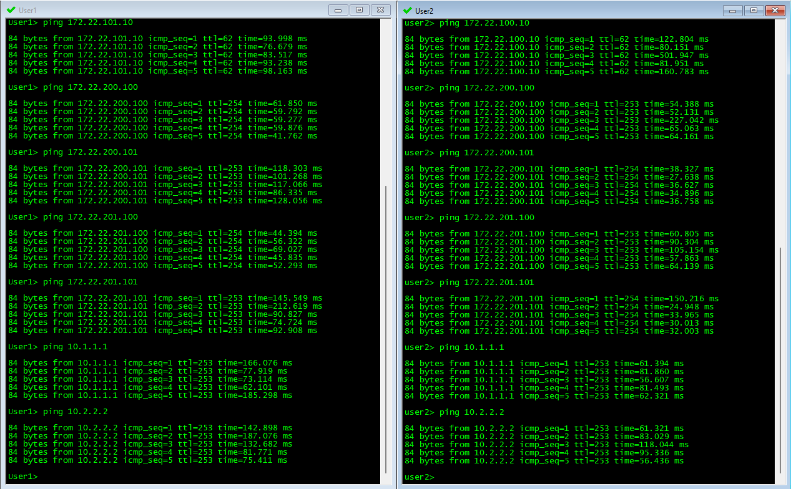

# Проектная работа

## Тема: Проектирование экстремально отказоустойчивой сети предприятия на базе технологии VxLAN EVPN

### Цель:

Целью работы является проработка вариантов модернизации существующей сети Предприятия, являющегося объектом критической инфраструктуры.

#### Исходные данные

Рассматривемая сеть Предприятия может быть описана следующими характеристиками:

 - все компоненты сети резервируются. В текущем варианте используется два ядра, разнесенных по разным серверным (в пределах здания либо в соседних зданиях). 
 - для подключения серверных ферм используется отдельный комплект коммутаторов в MLAG паре, подключенный L3 линками к обоим ядрам сети;
 - серверы в серверной ферме объединены в комплекс виртуализации, и разделены между серверными. Производительность комплекса расчитана таким образом, чтобы каждый полукомплект мог запустить весь необходимый набор виртуальных машин. 
 - этажные коммутаторы так же дублируются, каждый коммутатор подключен к своему ядру. При этом критические пользователи имеют два рабочих места, кажое из которых подключено к совему коммутатору. Для обычных пользователей предусмотрена возможность оперативного переключения рабочего места между коммутаторами.
 - сеть имеет некоторое количество каналов связи к нижестоящим и выщестоящим филиалам, а так же выход в сеть Интернет. Все каналы связи дублируются через разных опертаторов. Так же дублируются все маршрутизаторы и МСЭ, исполдьзуемые для подключения внешних каналов.

Основным требованием к сети является отказоустойчивость. Сервисы в сети должна сохранять работоспособность при:
 - отказе или выводе из эксплуатации любого коммутатора в сети;
 - полном отказе или выводе из эксплуатации одного из ядер сети;
 - одиночном отказе любого из линков;
 - отказе от одного до половины всех установленных серверов;
 - полном отключении одной серверной (отключение электропитания, пожар, потоп и т.п.). 

Допустимое максимальное время восстановления сервисов случае любого из вышеперечисленных сценарием составляет:
 - от 0 до 30 сек.  - отлично;
 - от 30 до 300 сек. - нежелательно, но приемлемо;
 - >= 300 сек. - неприемлемо, рассматривается как серьезный инцидент.

При этом требования к производительности сети по нынешним меркам относительно невысоки, пропускной способности ядра в 100Gb/s более чем достатончо для текущих задач даже с епрспективой роста в обозримом будущем.

 Имеющиеся проблемы и недостатки:
  - текущя версия сети простроена с использованием устаревшего оборудования Cisco. В нынешних условиях это ограничивает возможности расширения и модернизации ядра сети. 
  - текущая ситуация, в частности требования к импортозамещению оборудования, накладывает жесткие огранияения на выбор оборудования. Доступное оборудование не позволяет заменить ядро, построенное с использованием Cisco VSS, без ухудшения отказоустойчивости;
  - текущая топология сети имеет L2 петли. Протокол xSTP является истоником потенциальных отказов по причине блокировки ядра сети при изменении топологии или проблемах с оборудованием.
 
Текущая схема сети Предприятия представлена на следующем рисунке:


#### Предлагаемое решение

В настоящем проекте рассматривается вариант построения сети с вышеописанными характеристиками с использоованием топологии CLOS и технологии VxLAN EVPN. 
Топология CLOS (Spine-Leaf) — это идеальная физическая архитектура, обеспечивающая предсказуемую пропускную способность и отказоустойчивость. Технология VxLAN EVPN позволяет гибко и масштабируемо создавать изолированные L2- и L3-сервисы. 
Основные преимущества данной технологии для рассматриваемой задачи:

 - Отказоустойчивость: Выход из строя любого одного из коммутаторов не критичен. При необходимости коэффициент резервирования может быть увеличен путем добавления SPINE коммутаторов, при этом модернизация сети не потребует существенной перенастройки существующих коммутаторов или остановки сервисов. Использование технологии EVPN Multihoming позволяет резервировать подключение серверов, коммутаторов доступа, маршрутизаторов и МСЭ с возможностью терминации LACP линков на любых LEAF.
 - Гибкость: Возможность строить отказоустойчивые L2-домены, необходимые для как для кластеризации и миграции виртуальных машин, так и для работы других сервисов Предприятия, между любыми точками Underlay сети без использования протоколов группы STP, что нивелирует связанные ними риски. Возможность растяеуть L2 домен между разными площадками (например, при переезде филиала в новое здание);
 - Масштабируемость: возможность при необходимость увеличить емкость и/или производительность сети путем добавления Leaf или Spine коммутаторов без необходимости перенастройки существующей сети и остановки сервисов. 
 - Возможность изоляции трафика в разных VNI и VRF в масштабах сети позволяет разграничит внутренний трафик сети от внешнего;
 - Наличие коммутаторов производства РФ с поддержкой требуемой функциональности  (пример: Eltex MES5300-48 в качестве Leaf, MES5500-32 в каяестве Spine).
 
Предлагаемая схема сети Предприятия с использованием тополигии CLOS  и технологии VxLAN EVPM представлена на следующем рисунке:


-----


### Выполнение


В данной работе мы будем использовать сеть, настроенную в [лабораторной работе №7](https://github.com/i-gershuni/OTUS-DC-NET-Design-Labs/tree/ca121318e90c863ad347a526d3c6fd9c067b4f7e/Lab7), но в данной работе коммутаторы Leaf 1 и 2 буду использованы для подключения "хоста", а Leaf 3 и 4 будут использоваться в роли Border leaf.
Вместо "хоста" подключим к ним пограничный маршрутизатор.

Схема сети, используемая в данной работе, представлена на рисунке ниже:


### IPv4 адресация, используемая в данной работе

#### Адреса Loopback интерфейсов:

|  Spine |	S1 | S2 |
|-------------|---------------|---------------|
| loopback | 10.22.36.1/32 | 10.22.36.2/32 |

|  Leaf |	L1 | L2 | L3 | L4 |
|-------------|---------------|---------------|------------|------------|
| loopback |	10.22.37.1/32 | 10.22.37.2/32 | 10.22.37.3/32 | 10.22.37.4/32 |


На всех коммутаторах настроен Underlay на eBGP, номера AS на коммутаторах приведены в следующей таблице:

| Коммутатор | Номер AS |
|-----------|----------|
| Spine S1 | 6500 |
| Spine S2 | 6500 |
| Leaf L1 | 6501 |
| Leaf L2 | 6502 |
| Leaf L3 | 6503 |
| Leaf L4 | 6504 |


Предполагаем, что клиенты с адресацией из диапазона 172.22.0.0/16 находятся в существующем VRF L3VNI, а клиентов с адресами из диапазона 172.23.0.0/16  поместим в новый VRF L3VNI_A1.

#### Настройки IP на клиентских устройствах:

| Client | IP Addr | Def GW | VLAN | VRF |
|---|---|---|---|---|
| **C1** | 172.22.1.11/24 | 172.22.1.1 | 101 | L3VNI |
| **C2** | 172.22.2.22/24 | 172.22.2.1 | 102 | L3VNI |
| **C3** | 172.23.1.33/24 | 172.23.1.1 | 201 | L3VNI_A1 |

Задача настроить маршрутизацию между этими VRF через пограничный маршрутизатор ER1. Так же ER1 должен анонсировать default route в оба VRF, чтобы обеспечить им выход во "внешний мир", обозначенный на схеме облачком с адресом 8.8.8.8.


### Выполняем настройки на коммутаторах:

 - На всех Leaf создадим VRF L3VNI_A1, добавим его к VxLAN с vni 90001 и в router bgp;
 - Настроим на L1 и L2 клиентские VLAN и поместим в них клиентов в соответствии с таблицей выше;
 - Для подключения маршрутизатора ER1 к L3 и L4 в каждом VRF создадим PtP subinterface:
 
| VRF | Subif | L3 subnet | L4 subnet |	
|---|---|---|---|	
| L3VNI | 1000 | 172.22.255.0/31 | 172.22.255.2/31 |
| L3VNI_A1 | 1001 | 172.23.255.0/31 | 172.23.255.2/31 |

 - на L3 и L4 настраиваем BGP соседство с ER1 в каждом VRF и активируем его в address-family ipv4;
 - на L3 и L4 настраиваем суммаризацию маршрутов для каждого VRF; 
 - на маршрутизаторе ER1 настраиваем три VRF: L3VNI, L3VNI_A1 и INET, и настраиваем между ними route-leaking следующим образом:
 ```
 ip vrf INET
 rd 658888:3
 route-target export 658888:2000
 route-target import 658888:1000
 route-target import 658888:1001
!
ip vrf L3VNI
 rd 658888:1
 route-target export 658888:1000
 route-target import 658888:1001
 route-target import 658888:2000
!
ip vrf L3VNI_A1
 rd 658888:2
 route-target export 658888:1001
 route-target import 658888:2000
 route-target import 658888:1000
 ```
 - настраиваем sub-интерфейсы в сторону L3 и L4, помещая их в соответствующие vrf. Настраиваем интерфейс в сторону узла 8.8.8.8 в vrf INET;
 - настраиваем на ER1 BGP с AS 658888, настраиваем соседство с L3 и L4 для каждого vrf. Для vrf INET настраиваем redistribute static;
 - настраиваем в vrf INET default маршрут с адресом "8.8.8.8" в качестве шлюза.


### Итоговые настройки коммутаторов:

#### Настройки коммутатора L1:
```
hostname L1
!
vlan 101
   name Zone1
!
vlan 102
   name Zone2
!
vlan 201
   name Zone2_1
!
vrf instance L3VNI
!
vrf instance L3VNI_A1
!
interface Port-Channel1
   description Host 1
   switchport trunk allowed vlan 101-102,201
   switchport mode trunk
   !
   evpn ethernet-segment
      identifier 0000:0000:0000:0102:0001
      designated-forwarder election algorithm preference 100
      route-target import 00:00:00:01:02:01
   lacp system-id 1eaf.0102.0001
   spanning-tree bpdufilter enable
!
interface Ethernet1
   description Spoke1_Et1
   mtu 9214
   no switchport
   ip address 10.22.32.1/31
!
interface Ethernet2
   description Spoke2_Et1
   mtu 9214
   no switchport
   ip address 10.22.32.65/31
!
interface Ethernet8
   description Host1_et0/0
   channel-group 1 mode active
!
interface Loopback1
   ip address 10.22.37.1/32
!
interface Vlan101
   vrf L3VNI
   ip address virtual 172.22.1.1/24
!
interface Vlan102
   vrf L3VNI
   ip address virtual 172.22.2.1/24
!
interface Vlan201
   vrf L3VNI_A1
   ip address virtual 172.23.1.1/24
!
interface Vxlan1
   vxlan source-interface Loopback1
   vxlan udp-port 4789
   vxlan vlan 101 vni 10101
   vxlan vlan 102 vni 10102
   vxlan vlan 201 vni 10201
   vxlan vrf L3VNI vni 90000
   vxlan vrf L3VNI_A1 vni 90001
!
ip virtual-router mac-address 02:00:00:00:1e:af
!
ip routing
no ip icmp redirect
ip routing vrf L3VNI
ip routing vrf L3VNI_A1
!
router bgp 65501
   router-id 10.22.37.1
   no bgp default ipv4-unicast
   distance bgp 20 200 200
   maximum-paths 2 ecmp 2
   neighbor OVERLAY peer group
   neighbor OVERLAY remote-as 65500
   neighbor OVERLAY out-delay 0
   neighbor OVERLAY update-source Loopback1
   neighbor OVERLAY ebgp-multihop 2
   neighbor OVERLAY password 7 oNsKUXVXX/DkdbYvVeGk2A==
   neighbor OVERLAY send-community extended
   neighbor UNDERLAY peer group
   neighbor UNDERLAY remote-as 65500
   neighbor UNDERLAY out-delay 0
   neighbor UNDERLAY password 7 53+Z/5nyraWpgmFBkp2aHQ==
   neighbor 10.22.32.0 peer group UNDERLAY
   neighbor 10.22.32.64 peer group UNDERLAY
   neighbor 10.22.36.1 peer group OVERLAY
   neighbor 10.22.36.2 peer group OVERLAY
   !
   vlan 101
      rd 65501:101
      route-target both 65500:10101
      redistribute learned
   !
   vlan 102
      rd 65501:102
      route-target both 65500:10102
      redistribute learned
   !
   vlan 201
      rd 65501:201
      route-target both 65500:10201
      redistribute learned
   !
   address-family evpn
      neighbor OVERLAY activate
   !
   address-family ipv4
      neighbor UNDERLAY activate
      network 10.22.37.1/32
   !
   vrf L3VNI
      rd 65501:1
      route-target import evpn 6500:90000
      route-target export evpn 6500:90000
      redistribute connected
   !
   vrf L3VNI_A1
      rd 65501:2
      route-target import evpn 6500:90001
      route-target export evpn 6500:90001
      redistribute connected
!
end
```

#### Настройки коммутатора L2:
```
hostname L2
!
vlan 101
   name Zone1
!
vlan 102
   name Zone2
!
vlan 201
   name Zone2_1
!
vrf instance L3VNI
!
vrf instance L3VNI_A1
!
interface Port-Channel1
   description Host 1
   switchport trunk allowed vlan 101-102,201
   switchport mode trunk
   !
   evpn ethernet-segment
      identifier 0000:0000:0000:0102:0001
      designated-forwarder election algorithm preference 50
      route-target import 00:00:00:01:02:01
   lacp system-id 1eaf.0102.0001
   spanning-tree bpdufilter enable
!
interface Ethernet1
   description Spine1_Et2
   mtu 9214
   no switchport
   ip address 10.22.32.3/31
!
interface Ethernet2
   description Spine2_Et2
   mtu 9214
   no switchport
   ip address 10.22.32.67/31
!
interface Ethernet8
   description Host1_et0/1
   channel-group 1 mode active
!
interface Loopback1
   ip address 10.22.37.2/32
!
interface Vlan101
   vrf L3VNI
   ip address virtual 172.22.1.1/24
!
interface Vlan102
   vrf L3VNI
   ip address virtual 172.22.2.1/24
!
interface Vlan201
   vrf L3VNI_A1
   ip address virtual 172.23.1.1/24
!
interface Vxlan1
   vxlan source-interface Loopback1
   vxlan udp-port 4789
   vxlan vlan 101 vni 10101
   vxlan vlan 102 vni 10102
   vxlan vlan 201 vni 10201
   vxlan vrf L3VNI vni 90000
   vxlan vrf L3VNI_A1 vni 90001
!
ip virtual-router mac-address 02:00:00:00:1e:af
!
ip routing
no ip icmp redirect
ip routing vrf L3VNI
ip routing vrf L3VNI_A1
!
router bgp 65502
   router-id 10.22.37.2
   no bgp default ipv4-unicast
   distance bgp 20 200 200
   maximum-paths 2 ecmp 2
   neighbor OVERLAY peer group
   neighbor OVERLAY remote-as 65500
   neighbor OVERLAY out-delay 0
   neighbor OVERLAY update-source Loopback1
   neighbor OVERLAY ebgp-multihop 2
   neighbor OVERLAY password 7 oNsKUXVXX/DkdbYvVeGk2A==
   neighbor OVERLAY send-community extended
   neighbor UNDERLAY peer group
   neighbor UNDERLAY remote-as 65500
   neighbor UNDERLAY out-delay 0
   neighbor UNDERLAY password 7 53+Z/5nyraWpgmFBkp2aHQ==
   neighbor 10.22.32.2 peer group UNDERLAY
   neighbor 10.22.32.66 peer group UNDERLAY
   neighbor 10.22.36.1 peer group OVERLAY
   neighbor 10.22.36.2 peer group OVERLAY
   !
   vlan 101
      rd 65502:101
      route-target both 65500:10101
      redistribute learned
   !
   vlan 102
      rd 65502:102
      route-target both 65500:10102
      redistribute learned
   !
   vlan 201
      rd 65502:201
      route-target both 65500:10201
      redistribute learned
   !
   address-family evpn
      neighbor OVERLAY activate
   !
   address-family ipv4
      neighbor UNDERLAY activate
      network 10.22.37.2/32
   !
   vrf L3VNI
      rd 65502:1
      route-target import evpn 6500:90000
      route-target export evpn 6500:90000
      redistribute connected
   !
   vrf L3VNI_A1
      rd 65502:2
      route-target import evpn 6500:90001
      route-target export evpn 6500:90001
      redistribute connected
!
end
```

#### Настройки коммутатора L3:
```
hostname L3
!
vrf instance L3VNI
!
vrf instance L3VNI_A1
!
interface Ethernet1
   description Spine1_Et3
   mtu 9214
   no switchport
   ip address 10.22.32.5/31
!
interface Ethernet2
   description Spine2_Et3
   mtu 9214
   no switchport
   ip address 10.22.32.69/31
!
interface Ethernet8
   no switchport
!
interface Ethernet8.1000
   encapsulation dot1q vlan 1000
   vrf L3VNI
   ip address 172.22.255.0/31
!
interface Ethernet8.1001
   encapsulation dot1q vlan 1001
   vrf L3VNI_A1
   ip address 172.23.255.0/31
!
interface Loopback1
   ip address 10.22.37.3/32
!
interface Vxlan1
   vxlan source-interface Loopback1
   vxlan udp-port 4789
   vxlan vrf L3VNI vni 90000
   vxlan vrf L3VNI_A1 vni 90001
!
ip virtual-router mac-address 02:00:00:00:1e:af
!
ip routing
no ip icmp redirect
ip routing vrf L3VNI
ip routing vrf L3VNI_A1
!
router bgp 65503
   router-id 10.22.37.3
   no bgp default ipv4-unicast
   distance bgp 20 200 200
   maximum-paths 2 ecmp 2
   neighbor OVERLAY peer group
   neighbor OVERLAY remote-as 65500
   neighbor OVERLAY out-delay 0
   neighbor OVERLAY update-source Loopback1
   neighbor OVERLAY ebgp-multihop 2
   neighbor OVERLAY password 7 oNsKUXVXX/DkdbYvVeGk2A==
   neighbor OVERLAY send-community extended
   neighbor UNDERLAY peer group
   neighbor UNDERLAY remote-as 65500
   neighbor UNDERLAY out-delay 0
   neighbor UNDERLAY password 7 53+Z/5nyraWpgmFBkp2aHQ==
   neighbor 10.22.32.4 peer group UNDERLAY
   neighbor 10.22.32.68 peer group UNDERLAY
   neighbor 10.22.36.1 peer group OVERLAY
   neighbor 10.22.36.2 peer group OVERLAY
   !
   address-family evpn
      neighbor OVERLAY activate
   !
   address-family ipv4
      neighbor UNDERLAY activate
      network 10.22.37.3/32
   !
   vrf L3VNI
      rd 65503:1
      route-target import evpn 6500:90000
      route-target export evpn 6500:90000
      neighbor 172.22.255.1 remote-as 658888
      aggregate-address 172.22.0.0/16 summary-only
      redistribute connected
      !
      address-family ipv4
         neighbor 172.22.255.1 activate
   !
   vrf L3VNI_A1
      rd 65503:2
      route-target import evpn 6500:90001
      route-target export evpn 6500:90001
      neighbor 172.23.255.1 remote-as 658888
      aggregate-address 172.23.0.0/16 summary-only
      redistribute connected
      !
      address-family ipv4
         neighbor 172.23.255.1 activate
!
end
``` 

#### Настройки коммутатора L4:
```
hostname L4
!
vrf instance L3VNI
!
vrf instance L3VNI_A1
!
interface Ethernet1
   description Spine1_Et4
   mtu 9214
   no switchport
   ip address 10.22.32.7/31
!
interface Ethernet2
   description Spine2_Et3
   mtu 9214
   no switchport
   ip address 10.22.32.71/31
!
interface Ethernet8
   no switchport
!
interface Ethernet8.1000
   encapsulation dot1q vlan 1000
   vrf L3VNI
   ip address 172.22.255.2/31
!
interface Ethernet8.1001
   encapsulation dot1q vlan 1001
   vrf L3VNI_A1
   ip address 172.23.255.2/31
!
interface Loopback1
   ip address 10.22.37.4/32
!
interface Vxlan1
   vxlan source-interface Loopback1
   vxlan udp-port 4789
   vxlan vrf L3VNI vni 90000
   vxlan vrf L3VNI_A1 vni 90001
!
ip virtual-router mac-address 02:00:00:00:1e:af
!
ip routing
no ip icmp redirect
ip routing vrf L3VNI
ip routing vrf L3VNI_A1
!
router bgp 65504
   router-id 10.22.37.4
   no bgp default ipv4-unicast
   distance bgp 20 200 200
   maximum-paths 2 ecmp 2
   neighbor OVERLAY peer group
   neighbor OVERLAY remote-as 65500
   neighbor OVERLAY out-delay 0
   neighbor OVERLAY update-source Loopback1
   neighbor OVERLAY ebgp-multihop 2
   neighbor OVERLAY password 7 oNsKUXVXX/DkdbYvVeGk2A==
   neighbor OVERLAY send-community extended
   neighbor UNDERLAY peer group
   neighbor UNDERLAY remote-as 65500
   neighbor UNDERLAY out-delay 0
   neighbor UNDERLAY password 7 53+Z/5nyraWpgmFBkp2aHQ==
   neighbor 10.22.32.6 peer group UNDERLAY
   neighbor 10.22.32.70 peer group UNDERLAY
   neighbor 10.22.36.1 peer group OVERLAY
   neighbor 10.22.36.2 peer group OVERLAY
   !
   address-family evpn
      neighbor OVERLAY activate
   !
   address-family ipv4
      neighbor UNDERLAY activate
      network 10.22.37.4/32
   !
   vrf L3VNI
      rd 65504:1
      route-target import evpn 6500:90000
      route-target export evpn 6500:90000
      neighbor 172.22.255.3 remote-as 658888
      aggregate-address 172.22.0.0/16 summary-only
      redistribute connected
      !
      address-family ipv4
         neighbor 172.22.255.3 activate
   !
   vrf L3VNI_A1
      rd 65504:2
      route-target import evpn 6500:90001
      route-target export evpn 6500:90001
      neighbor 172.23.255.3 remote-as 658888
      aggregate-address 172.23.0.0/16 summary-only
      redistribute connected
      !
      address-family ipv4
         neighbor 172.23.255.3 activate
!
end
``` 

#### Настройки маршрутизатора ER1:

```
hostname ER1
!
!
ip vrf INET
 rd 658888:3
 route-target export 658888:2000
 route-target import 658888:1000
 route-target import 658888:1001
!
ip vrf L3VNI
 rd 658888:1
 route-target export 658888:1000
 route-target import 658888:1001
 route-target import 658888:2000
!
ip vrf L3VNI_A1
 rd 658888:2
 route-target export 658888:1001
 route-target import 658888:2000
 route-target import 658888:1000
!
interface Loopback0
 ip address 10.22.38.1 255.255.255.255
!
interface GigabitEthernet0/0
 no ip address
 duplex auto
 speed auto
 media-type rj45
!
interface GigabitEthernet0/0.1000
 encapsulation dot1Q 1000
 ip vrf forwarding L3VNI
 ip address 172.22.255.1 255.255.255.254
!
interface GigabitEthernet0/0.1001
 encapsulation dot1Q 1001
 ip vrf forwarding L3VNI_A1
 ip address 172.23.255.1 255.255.255.254
!
interface GigabitEthernet0/1
 no ip address
 duplex auto
 speed auto
 media-type rj45
!
interface GigabitEthernet0/1.1000
 encapsulation dot1Q 1000
 ip vrf forwarding L3VNI
 ip address 172.22.255.3 255.255.255.254
!
interface GigabitEthernet0/1.1001
 encapsulation dot1Q 1001
 ip vrf forwarding L3VNI_A1
 ip address 172.23.255.3 255.255.255.254
!
interface GigabitEthernet0/2
 ip vrf forwarding INET
 ip address 8.8.8.1 255.255.255.0
 duplex auto
 speed auto
 media-type rj45
!
!
router bgp 658888
 bgp router-id interface Loopback0
 bgp log-neighbor-changes
 maximum-paths 32
 !
 address-family ipv4 vrf INET
  network 0.0.0.0
  redistribute static
 exit-address-family
 !
 address-family ipv4 vrf L3VNI
  neighbor 172.22.255.0 remote-as 65503
  neighbor 172.22.255.0 activate
  neighbor 172.22.255.0 as-override
  neighbor 172.22.255.2 remote-as 65504
  neighbor 172.22.255.2 activate
  neighbor 172.22.255.2 as-override
 exit-address-family
 !
 address-family ipv4 vrf L3VNI_A1
  neighbor 172.23.255.0 remote-as 65503
  neighbor 172.23.255.0 activate
  neighbor 172.23.255.0 as-override
  neighbor 172.23.255.2 remote-as 65504
  neighbor 172.23.255.2 activate
  neighbor 172.23.255.2 as-override
 exit-address-family
!
ip route vrf INET 0.0.0.0 0.0.0.0 8.8.8.8
!
```

***

### Проверка результатов

##### Посмотрим на Type5 маршруты (на примере Leaf 1). Убедимся, что мы получили суммарные маршруты на сети 172.22.0.0/16 и 172.23.0.0/16 и default route:
```
L1#show bgp evpn route-type ip-prefix ipv4 
BGP routing table information for VRF default
Router identifier 10.22.37.1, local AS number 65501
Route status codes: * - valid, > - active, S - Stale, E - ECMP head, e - ECMP
                    c - Contributing to ECMP, % - Pending BGP convergence
Origin codes: i - IGP, e - EGP, ? - incomplete
AS Path Attributes: Or-ID - Originator ID, C-LST - Cluster List, LL Nexthop - Link Local Nexthop

          Network                Next Hop              Metric  LocPref Weight  Path
 * >Ec    RD: 65503:1 ip-prefix 0.0.0.0/0
                                 10.22.37.3            -       100     0       65500 65503 658888 i
 *  ec    RD: 65503:1 ip-prefix 0.0.0.0/0
                                 10.22.37.3            -       100     0       65500 65503 658888 i
 * >Ec    RD: 65503:2 ip-prefix 0.0.0.0/0
                                 10.22.37.3            -       100     0       65500 65503 658888 i
 *  ec    RD: 65503:2 ip-prefix 0.0.0.0/0
                                 10.22.37.3            -       100     0       65500 65503 658888 i
 * >Ec    RD: 65504:1 ip-prefix 0.0.0.0/0
                                 10.22.37.4            -       100     0       65500 65504 658888 i
 *  ec    RD: 65504:1 ip-prefix 0.0.0.0/0
                                 10.22.37.4            -       100     0       65500 65504 658888 i
 * >Ec    RD: 65504:2 ip-prefix 0.0.0.0/0
                                 10.22.37.4            -       100     0       65500 65504 658888 i
 *  ec    RD: 65504:2 ip-prefix 0.0.0.0/0
                                 10.22.37.4            -       100     0       65500 65504 658888 i
 * >Ec    RD: 65503:1 ip-prefix 172.22.0.0/16
                                 10.22.37.3            -       100     0       65500 65503 i
 *  ec    RD: 65503:1 ip-prefix 172.22.0.0/16
                                 10.22.37.3            -       100     0       65500 65503 i
 * >Ec    RD: 65503:2 ip-prefix 172.22.0.0/16
                                 10.22.37.3            -       100     0       65500 65503 658888 658888 i
 *  ec    RD: 65503:2 ip-prefix 172.22.0.0/16
                                 10.22.37.3            -       100     0       65500 65503 658888 658888 i
 * >Ec    RD: 65504:1 ip-prefix 172.22.0.0/16
                                 10.22.37.4            -       100     0       65500 65504 i
 *  ec    RD: 65504:1 ip-prefix 172.22.0.0/16
                                 10.22.37.4            -       100     0       65500 65504 i
 * >Ec    RD: 65504:2 ip-prefix 172.22.0.0/16
                                 10.22.37.4            -       100     0       65500 65504 658888 65503 i
 *  ec    RD: 65504:2 ip-prefix 172.22.0.0/16
                                 10.22.37.4            -       100     0       65500 65504 658888 65503 i
 * >      RD: 65501:1 ip-prefix 172.22.1.0/24
                                 -                     -       -       0       i
 * >Ec    RD: 65502:1 ip-prefix 172.22.1.0/24
                                 10.22.37.2            -       100     0       65500 65502 i
 *  ec    RD: 65502:1 ip-prefix 172.22.1.0/24
                                 10.22.37.2            -       100     0       65500 65502 i
 * >      RD: 65501:1 ip-prefix 172.22.2.0/24
                                 -                     -       -       0       i
 * >Ec    RD: 65502:1 ip-prefix 172.22.2.0/24
                                 10.22.37.2            -       100     0       65500 65502 i
 *  ec    RD: 65502:1 ip-prefix 172.22.2.0/24
                                 10.22.37.2            -       100     0       65500 65502 i
 * >Ec    RD: 65503:1 ip-prefix 172.23.0.0/16
                                 10.22.37.3            -       100     0       65500 65503 658888 65504 i
 *  ec    RD: 65503:1 ip-prefix 172.23.0.0/16
                                 10.22.37.3            -       100     0       65500 65503 658888 65504 i
 * >Ec    RD: 65503:2 ip-prefix 172.23.0.0/16
                                 10.22.37.3            -       100     0       65500 65503 i
 *  ec    RD: 65503:2 ip-prefix 172.23.0.0/16
                                 10.22.37.3            -       100     0       65500 65503 i
 * >Ec    RD: 65504:1 ip-prefix 172.23.0.0/16
                                 10.22.37.4            -       100     0       65500 65504 658888 658888 i
 *  ec    RD: 65504:1 ip-prefix 172.23.0.0/16
                                 10.22.37.4            -       100     0       65500 65504 658888 658888 i
 * >Ec    RD: 65504:2 ip-prefix 172.23.0.0/16
                                 10.22.37.4            -       100     0       65500 65504 i
 *  ec    RD: 65504:2 ip-prefix 172.23.0.0/16
                                 10.22.37.4            -       100     0       65500 65504 i
 * >      RD: 65501:2 ip-prefix 172.23.1.0/24
                                 -                     -       -       0       i
 * >Ec    RD: 65502:2 ip-prefix 172.23.1.0/24
                                 10.22.37.2            -       100     0       65500 65502 i
 *  ec    RD: 65502:2 ip-prefix 172.23.1.0/24
                                 10.22.37.2            -       100     0       65500 65502 i
```

##### Проверим итоговую таблицу маршрутизации для каждого VRF, убедимся, что в ней есть оба ECMP маршрута до другого VRF и default:
```
L1#show ip route vrf L3VNI

VRF: L3VNI
Codes: C - connected, S - static, K - kernel, 
       O - OSPF, IA - OSPF inter area, E1 - OSPF external type 1,
       E2 - OSPF external type 2, N1 - OSPF NSSA external type 1,
       N2 - OSPF NSSA external type2, B - Other BGP Routes,
       B I - iBGP, B E - eBGP, R - RIP, I L1 - IS-IS level 1,
       I L2 - IS-IS level 2, O3 - OSPFv3, A B - BGP Aggregate,
       A O - OSPF Summary, NG - Nexthop Group Static Route,
       V - VXLAN Control Service, M - Martian,
       DH - DHCP client installed default route,
       DP - Dynamic Policy Route, L - VRF Leaked,
       G  - gRIBI, RC - Route Cache Route

Gateway of last resort:
 B E      0.0.0.0/0 [20/0] via VTEP 10.22.37.4 VNI 90000 router-mac 50:00:00:ae:f7:03 local-interface Vxlan1
                           via VTEP 10.22.37.3 VNI 90000 router-mac 50:00:00:15:f4:e8 local-interface Vxlan1

 C        172.22.1.0/24 is directly connected, Vlan101
 C        172.22.2.0/24 is directly connected, Vlan102
 B E      172.22.0.0/16 [20/0] via VTEP 10.22.37.4 VNI 90000 router-mac 50:00:00:ae:f7:03 local-interface Vxlan1
                               via VTEP 10.22.37.3 VNI 90000 router-mac 50:00:00:15:f4:e8 local-interface Vxlan1
 B E      172.23.0.0/16 [20/0] via VTEP 10.22.37.4 VNI 90000 router-mac 50:00:00:ae:f7:03 local-interface Vxlan1
                               via VTEP 10.22.37.3 VNI 90000 router-mac 50:00:00:15:f4:e8 local-interface Vxlan1

L1#show ip route vrf L3VNI_A1 

VRF: L3VNI_A1
Codes: C - connected, S - static, K - kernel, 
       O - OSPF, IA - OSPF inter area, E1 - OSPF external type 1,
       E2 - OSPF external type 2, N1 - OSPF NSSA external type 1,
       N2 - OSPF NSSA external type2, B - Other BGP Routes,
       B I - iBGP, B E - eBGP, R - RIP, I L1 - IS-IS level 1,
       I L2 - IS-IS level 2, O3 - OSPFv3, A B - BGP Aggregate,
       A O - OSPF Summary, NG - Nexthop Group Static Route,
       V - VXLAN Control Service, M - Martian,
       DH - DHCP client installed default route,
       DP - Dynamic Policy Route, L - VRF Leaked,
       G  - gRIBI, RC - Route Cache Route

Gateway of last resort:
 B E      0.0.0.0/0 [20/0] via VTEP 10.22.37.4 VNI 90001 router-mac 50:00:00:ae:f7:03 local-interface Vxlan1
                           via VTEP 10.22.37.3 VNI 90001 router-mac 50:00:00:15:f4:e8 local-interface Vxlan1

 B E      172.22.0.0/16 [20/0] via VTEP 10.22.37.4 VNI 90001 router-mac 50:00:00:ae:f7:03 local-interface Vxlan1
                               via VTEP 10.22.37.3 VNI 90001 router-mac 50:00:00:15:f4:e8 local-interface Vxlan1
 C        172.23.1.0/24 is directly connected, Vlan201
 B E      172.23.0.0/16 [20/0] via VTEP 10.22.37.4 VNI 90001 router-mac 50:00:00:ae:f7:03 local-interface Vxlan1
                               via VTEP 10.22.37.3 VNI 90001 router-mac 50:00:00:15:f4:e8 local-interface Vxlan1

L1#
```


##### Проверим связность между клиентскими устройствами с помощью ***ping***: 



##### С помощью traceroute убедимся, что внутри VRF пакеты ходят не покидая фабрики, а между VRF идут через ER1: 


***

## Цель работы достигнута, передача суммарных префиксов через EVPN route-type 5 настроена и работает.

